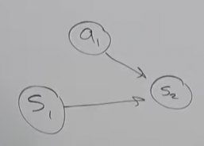
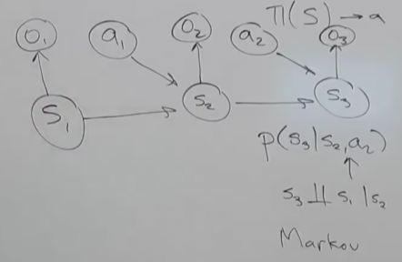
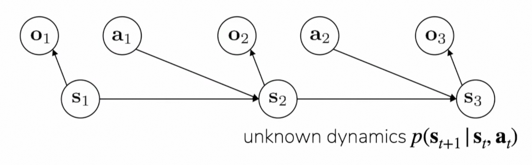
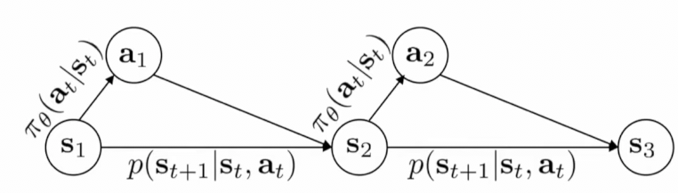

# Lecture 1 Class Intro

## What do we mean by deep reinforcement learning?

**Sequential decision-making problems**

A system needs to make _multiple_ decisions based on stream of information.
observe, take action, observe, take action...

AND the solutions to such problems

- imitation learning
- model-free & model-based RL
- offline & online RL
- multi-task & meta RL
- RL for LLMs
- RL for robots

and more!

Emphasis will be made on Deep Neural Networks.

## How does deep RL differ from other ML topics?

**Supervised learning**

$$ \text{Given labeled data: } \{(x, y)\} \text{, learn }\quad f(x) \approx y $$

In supervised learning we are:

- directly told what to output
- inputs $x$ are independetly, identically distributed (i.i.d.)

**Reinforcement learning**

In Reinforcmenet learning we are primarily concerned with mapping states to
action, which is represented as:

$$ \pi(s) \to a $$

The goal therefore is to:

Learn behavior $\pi\left(a\mid s\right)$.

This will be done:

- from experience, indirect feedback

In this context, behaviormeans:

Behavior can include:

- motor control
- chat bots
- game playing
- driving
- web agents

This is how reinforcement learning differs from typical machine learning.

## We can't cover everything in RL.

We'll focus on:

- core concepts behind deep RL methods
- implementation of algorithms
- examples in robotics, control, language models (but techniques generalize
  broadly)
- topics that we think are most useful & exciting

For more theory & other applications of RL, see Standford CS234.

The **Core goal** of this lecture series is to be able to understand and
implement existing and emerging methods in RL.

## Why study deep reinforcement learning?

1. Going beyond supervised $(x, y)$ examples

   - AI model predictions have consequences? : How can we take them into
     account?

   - When direct supervision isn't available

2. Widely used and deployed for performant AI systems

3. Learning from experience seems fundamental to intelligence

   - RL can discover new solutions

4. Plenty of exciting open research problems

**Beyond supervised learning**

- Decision-making problems are everywhere!

a. Any sort of AI agents: robots, autonomous vehicles, web assistants

b. What if you want your AI system to interact with people? (chatbots,
recommenders)

c. What if deploying your system affects future outcomes & observations?
"feedback loops"

d. What if you don't have labels or your objective isn't just accuracy? (and
isn't differentiable!)

**Widely used for performant AI systems**

Learning complex physical tasks: legged robots

https://www.youtube.com/watch?v=9G9E-TIKGM8

https://www.youtube.com/watch?v=xG7WkPU8tgs

Learn complex physical tasks: robot manipulation

https://www.youtube.com/watch?v=gg9AYgtYoNs

Learning to play complex games, and ability to discover new solutions.

Not just robots and games!

Nearly all modern language models use some form of RL for post-training.

Research on traffic control

Training generative imag emodels to follow their prompt

Chip design, in Google's production TPU chips.

Still lots of exciting research problems!

How does robot learn to represent what is good or bad for the task?

How can an agent generalize its behavior to many different scenarios? - (Can we
apply such a system at scale?)

        - Leverage large, diverse datasets

        - Transfer from other tasks, goals

Can use RL to learn long-horizon tasks, like cooking a meal?

Can robots practice fully autonomously?

## Intro to modeling behavior and reinforcement learning

**How to represent experience as data?**

Typically the way we represent experience as data is:

state $\mathbf{s}_t$ - the state of the "world" at time $\mathbf{t}$.

Though sometimes we do not have direct access to the state of the "world", and
so sometimes an observation is used instead of a state:

observation $\mathbf{o}_t$ - what the agent observes over time $\mathbf{t}$

Once we know that the agent is observing, we'l also need to capture how it's
taking actions, how it's actually making decisions, which are referred to like
so:

action $\mathbf{a}_t$ - the decision taken at time $t$

nd then in terms of a given interaction within the environment, we will think of
that as a trajectory, a sequence of states and actions or a sequence of
observations and actions.

trajectory $\mathbf{t}$ - sequence of states/observations and actions

$$ \left(\mathbf{s}_1, \mathbf{a}_1, \mathbf{s}_2, \mathbf{a}_2, \dots, \mathbf{s}_T, \mathbf{a}_T\right) $$

Note that the length of the trajectory could be $T = 1$!

Then we need to think of the goal of the task. And that's where reward functions
come in, which essentially tell us how good are the states/actions?

reward function $r(\mathbf{s}, \mathbf{a})$ - how good is $\mathbf{s}$,
$\mathbf{a}$?

**States vs. observations**

Next state is purely a function of the current state and action (and randomness)

Say we have our starting state, $s_1$ and we also have our starting action
$a_1$, these two will inform the next state, $s_2$.

And then from there, another action is taken, $a_2$, and both $s_2$ and $a_2$
will subsequently inform the next state, $s_3$, and so on.

One thing that should be considered is that sometime the environment under which
the action is being taken is changing, so that can be represented like:

$P(s_3 \mid s_2, a_2)$

Which is read as what is the probability of $P$ for $s_3$ given $s_2$ and $a_2$.

In essenece, what is the probability of achieving $s_3$ given the previous state
and how well the previous action performed.

The crucial thing to understand here is that the current state only depenends on
the previous state and action, and no others. In other words $s_3$ depends on
$s_2$ and $a_2$, but _not_ $s_1$ and $a_1$! In Latex, this is expressed like so:

$$ s_3 \perp\!\!\!\perp s_1 \mid s_2 $$

Where $\perp\!\!\!\perp$ means "independent of".

And this sort of independence property is called the
[Markov property](https://en.wikipedia.org/wiki/Markov_property), which is very
useful in RL, as it means that states are determined by a _defined_ set of
states/actions.

Now, if you have observations instead of states, then things look a little bit
different.

The way we can think of observations is that an observation $o_1$ is a _function
of_ the current state, $s_1$, and the observation, $o_1$, may not contain all
the information that's in the state, $s_1$.

And this means that if we cannot observe the state, say of $s_3$, then that
means the observation $o_3$, now becomes a function of $o_1$. Again, if you
_cannot observe the corresponding state_.

Next state is purely a function of the current state and action (and randomness)

**Robot Example**

Let's consider a robotic arm, moving a towel across a surface. The state could
be anything like:

state $\mathbf{s}$ - RGB images, joint positions, joint velocities

The action would be the next joint position, how are we going to move the joint?

action $\mathbf{a}$ - commanded next joint position

The trajectory would then be a sequence of states and actions. In this case a
sequence of images.

trajectory $\mathbf{t}$ - 10-sec sequence of camera, joint readings, controls at
20 Hz

$$ \left(\mathbf{s}_1, \mathbf{a}_1, \mathbf{s}_2, \mathbf{a}_2, \dots, \mathbf{s}_T, \mathbf{a}_T\right) = 200 $$

In practice this means for this particular example that we will be taking
snapshots 20 times per second, and taking actions 20 times per second. While
unintuitive, this thinking about state as being snapshots in time does help
represent data and behavior on physical systems like robots.

The reward function can be thought of a simple binary:

reward $r(\mathbf{s}, \mathbf{a})$ = 1 if the towel is on the hook in state $s$,
0 otherwise.

**Chatbot Example**

Because we don't know the state of what the user will send, we can only make an
observation, which again, is only representative of some, but not all, of the
data of the state.

observation $\mathbf{o}$ - the user's most recent message

The action would then be the chatbot's response

action $\mathbf{a}$ - the chatbot's next message

The trajectory in this example could be thought of as the conversation trace, or
the history of the conversation.

$$ \left(\mathbf{o}_1, \mathbf{a}_1, \mathbf{o}_2, \mathbf{a}_2, \dots, \mathbf{o}_T, \mathbf{a}_T\right) $$

Unlike the robot example, there is not a fixed rate of inputs, as it may take
longer or shorter periods of time for the user to respond to the chatbot, and so
this is example of how trajectories might vary in terms of how time is
represented. So, in the first case, time is represented as a 20th of a second,
and in the second case, time is represented as when the user responds next.

The following is an example reward, maybe there's a voting system or some other
metric for rewards:

reward $r(\mathbf{s}, \mathbf{a))$ = 1 if the user gives upvore, -10 if the user
downvotes, 0 if no user feedback.

## How to represent behavior with a neural network?

So how do we actually represent behavior?

What we want to do in most cases in RL is we want to map states to action:

$$ \mathbf{s} \to \mathbf{a} $$

And to do that, we use what is called a _policy_. This policy will often use
$\pi$ to denote a policy:

$$ \pi_\theta\left(\mathbf{a}\mid \mathbf{s}\right) $$

This policy could be a neural network, in the below figure, it is a
convolutional neural network. It could be a transformer, it could be a simple
fully connected neural network, it could be a linear function. Whatever the
implementation, the purpose of the policy is to map a sequence of observations
to actions.

We typically use $\theta$ to refer to the parameters of that neural network that
we're trying to learn.

This process looks like:

- Observe state $\mathbf{s}_t$

- Take action $\mathbf{a}_t$ (e.g. when an action is taking, we take a sampling
  from the policy $\pi_\theta\left(\cdot \mid \mathbf{s}_t\right)$, the neural
  network)

- Observe next state $\mathbf{s}_{t + 1}$ (sampled from unknown world dynamics
  $p\left(\cdot \mid \mathbf{s}_t, \,mathbf{a}_t\right)$)

- Result: a trajectory
  $\mathbf{s}_1, \mathbf{a}_1, \dots \mathbf{s}_T, \mathbf{a}_T$, also called a
  policy _roll-out_ or an _episode_.

If you only have observations $\mathbf{o}$, then the solution is to give the
policy memory:

$$ \pi_\theta\left(\mathbf{a}_t \mid \mathbf{o}_{t - m}, \dots, \mathbf{o}_t\right) $$

Again, this is because observations do depend on the previous states, whereas
when we are using states, you only have to give the policy the current state.
Note that this means that when using observations, this starts to literally take
up more computing resources like RAM/VRAM.

## What is the goal of reinforcement learning?

The goal of RL is to maximize the sum of rewards:

maximize sum of rewards:

$$ \max \sum_{t}^{T}{r(\mathbf{s}_t, \mathbf{a}_t)} $$

But note that $r(\mathbf{s}_t, \mathbf{a}_t)$ is not a deterministic quantity!

This essentially means that if you have a policy and you're then executing that
policy in the world, the reward you get isn't always going to be the same every
time you run your policy (the rewards are not reproducible).

Pause for a moment, and question what are the sources of variability? What are
some potential sources that might cause the sum of rewards to differ from one
trajectory to another trajectory?

For one, randomness can affect the state as it is iterated over the trajectory.
Additionally, the policy itself might not be deterministic.

Generally speaking, there are two well recognized sources of variability for our
reward sum function. One is that the world is stochastic (involves randomness),
the other is that the policy is not deterministic.

1. the world is stochastic

2. the policy is not deterministic (the outcome of the neural network may not
   make the same decision every time).

In our modeling of states to action, we actually can map our policy as a link
between each state and action.

Now if we want to write down what rewards look like, we have to think about a
probability distribution over trajectory, meaning what is the kind of
distribution over futures that we'll see. The way we can think of that is if we
have some initial state $P(s_1)$, and after the state there is a decision made
with some policy $\pi(\mathbf{a}_t \mid \mathbf{s}_t)$, and then once the
decision is made, there is randomness (probability) that arises from that
dynamic $P(\mathbf{s}_{t+1}\mid \mathbf{s}_{t}, \mathbf{a}_t)$.

This gives us a way to express the overall probability distribution over the
entire trajectory of states, where the initial state is independent of the
policy and its resulting randomness:

$$ P(T) = P(\mathbf{s}_1) \prod_{t=1}^T \pi(\mathbf{a}_t \mid \mathbf{s}_t)P(\mathbf{s}_{t+1} \mid \mathbf{s}_t, \mathbf{a}_t) $$

Once we have determined $P(T)$, this gives us insights into how we might think
about maximizing rewards for our RL model.

$$ \mathbb{E}_{T\sim p_\theta(t)}\left[\sum_{t}^{T}{r(\mathbf{s}_t, \mathbf{a}_t)}\right] $$

This is read as our Expectations of the trajectories sampled over the
probability distribtution of the sum of the states and actions in this
trajectory, of the reward of that state and argument.

Our goal is to maximize this, and to find some policy $\pi$ that maximizes the
expected sum of rewards.

$$ \max_{\pi} \mathbb{E}_{T\sim p\theta(t)}\left[\sum_{t}^{T}{r(\mathbf{s}_t, \mathbf{a}_t)}\right] $$

Thusly, instead of maximizing the sum of rewards, we are instead looking to
maximize the _expected_ sum of rewards, and that is to find a policy that
achieves this goal.

$$ \underbrace{p(\mathbf{s_1}, \mathbf{a}_1, \dots, \mathbf{s}_T, \mathbf{a}_T)}_{p\theta(\mathcal{T})} = p(\mathbf{s}_1)\prod_{t=1}^{T}\pi_\theta(\mathbf{a}_t\mid \mathbf{s}_t)p(\mathbf{s}_{t+1} \mid \mathbf{s}_t, \mathbf{a}_t) $$

Alot of this class will be figuring out how to optimize behavior under this
particular objective.

One thing to consider is if we are only concerned about near term rewards. Say
that $T$ represents a thousand years, and we want our trajectory to be fixed to
a closer time period to the present. By introducing a weight through what is
known to a "discount factor" to our vanilla maximum expected sum of rewards.
This is written using the greek ltter gamma: $\gamma$.

$$ \max_{\pi} \mathbb{E}_{T\sim p\theta(t)}\left[\sum_{t}^{T}\gamma^t{r(\mathbf{s}_t, \mathbf{a}_t)}\right] $$

Usually the discount factor is restricted between $0$ and $1$:

$$ 0 < \gamma \leq 1 $$

And if $\gamma = 1$, this is the same as the original formulation, and as you
make it lower and lower, you are getting more greedy, you care more about near
term rewards than overall rewards.

**Aside: why stochastic policies?**

1. **Exploration**: to learn from your own experience, you must try different
   things.

2. **Modeling stochastic behavior**: existing data will exhibit varying
   behaviors.

We can leverage tools from generative modeling!

-> generative model over actions given states/observations

**How good is a particular policy?**

The reference for how good a particular policy is is referred to as a "value
function". We think about a Value function given a particular state, and we
denote it as:

value function $V^\pi(\mathbf{s})$ - future expected reward starting at $s$ and
following $\pi$.

This is the future expected reward if you start at $\mathbf{s}$ and then follow
policy $\pi$ from then onward. It is the same as the vanilla maximum expected
rewards equation, except starting at $\mathbf{s}$ instead of $T\sim p(t)$.

**Types of algorithms**

We will cover many algorithms. You will see the maximum expected sum of rewards
function alot.

$$ \max_{\pi} \mathbb{E}_{T\sim p\theta(t)}\left[\sum_{t}^{T}{r(\mathbf{s}_t, \mathbf{a}_t)}\right] $$

These will be used in:

1. **Imitation learning**: mimic a policy that achieves high reward

2. **Policy gradients**: directly differentiate the above objective

3. **Actor-critic**: estimate value of the current policy and use it to make the
   policy better

4. **Value-based**: estimate the value of the optimal policy

5. **Model-based**: learn to model the dynamics, and use it for planning or
   policy improvement

**Why so many algorithms?**

In Supervised Learning, we just have gradient descent, it works, it's great, so
why does Unsupervised Learning have so many algorithms?

In RL, things are less simple.

Alogorithms make different trade-offs, thrive under different assumptions.

- How easy/cheap is it to collect data with policy? (e.g. simulator vs.
  hand-written)

- How easy/cheap are different forms of supervision? (demos, detailed rewards)

- How important is stability and ease-of-use?

- Action space dimensionality, continuous vs. discrete

- Is it easy to learn the dynamics model?

**Recap of definitions**

state $\mathbf{s}_t$ - the state of the "world" at time $t$

or observation $\mathbf{o}_t$ - what the agent observes at time $t$

action $\mathbf{a}_t$ - the decision taken at time $t$

reward function $r(\mathbf{s}, \mathbf{a})$ - how good is $\mathbf{s}$,
$\mathbf{a}$?

initial state distribution $p(\mathbf{s}_1)$, unknown dynamics
$p(\mathbf{s}_{t+1} \mid \mathbf{s}_t, \mathbf{a}_t)$

These definitions, when executed in a process of finding some reward, is what is
known as the Markov decision process (MDP), or if you only have observations, it
is known as a partially-observed Markov decision process (POMDP).

We also talked about the following definitions:

trajectory $\mathcal{T}$ - sequence of states/observations and actions
$(\mathbf{s}_1, \mathbf{a}_1, \mathbf{s}_2, \mathbf{a}_2, \dots \mathbf{s}_T, \mathbf{a}_T)$

policy $\pi$ - represents behavior, selecting actions based on states or
observations

**Goal:** learn policy $\pi_\theta$ that maximizes _expected_ sum of rewards:

$$ \max \mathbb{E}_{\mathcal{T} \sim p_\theta(\mathcal{T})}\left[\sum_{t}^{T}{r(\mathbf{s}_t, \mathbf{a}_t)}\right] $$

value function $V^\pi(\mathbf{s})$ - future expected reward starting at
$\mathbf{s}$ and following $\pi$

Q- function $Q^\pi(\mathbf{s}, \mathbf{a})$ - future expected reward starting at
$\mathbf{s}$ taking $\mathbf{a}$, then following $\pi$
