# Lecture 2: Imitation Learning

Today we'll be talking about Imitation Learning, which is one way to maximize
the expected sum of rewards. This is done by imitating a good policy.

## The plan for today

**Imitation Learning**

1. Imitation learning basic

2. Learning expressive policy distributions

3. Learning from online interventions

4. Time permitting; how to collect demonstrations

**Key Learning goals:**

- how to represent distributions with neural networks

- why expressive distributions matter for imitation learning

- what are compounding errors and how to address them

**What is the goal of imitation learning?**

**Data**: Given trajectories collected by an expert referred to as
"demonstrations".

$$ \mathscr{D} := \{(\mathbf{s}_1, \mathbf{a}_1, \dots , \mathbf{s}_T)\} $$

An example of this dataset might look like think of:

- Dataset from human drivers

- Sensor readings + steering commands

Our demonstrations are sampled from some unknown policy expert, denoted as
$\pi_{\text{expert}}$

**Goal**: Learn a policy $\pi_\theta$ that performs at the level of the expert
policy, by mimicking it.

## Imitating learning - version 0

0. Given demonstration data set, $\mathscr{D} := \{(\mathbf{s}, \mathbf{a})\}$

1. Train $\pi_\theta$, this gives us some predicted value $\hat{a}$ which is
   sampled from our policy:

$$ \hat{a} \sim \pi_\theta(\cdot \mid \mathbf{s}) $$

We can then say that our predicted action $\hat{a}$ is as close as possible to
the action the demonstrator took (the $a$ in $\mathscr{D}$). Thusly we want to
minimize the distance between the predicted $\hat{a}$ and the actual action $a$,
which we can calculate by taking the difference between $\hat{a}$ and $a$,
squaring it (to make it positive), and sum all those values over the course of
the entire demonstration (the entire dataset), and then take the minimum, which
applies it to some policy $\theta$:

$$ \min_\theta \frac{1}{|\mathscr{D}|}\sum_{(\mathbf{s}, \mathbf{a}) \in \mathscr{D}}^{}{|| \hat{a} - a ||^2} $$

where:

$$ \hat{a} = \pi_\theta(\mathbf{s}) $$

2. Deploy the policy $\pi_\theta$

This is version 0 of Imitatoin learning.

In essentially the main point 1. means that we are doing a forward pass here:

$$ \hat{a} \sim \pi\theta(\cdot \mid \mathbf{s}) $$

In other words we sample a minibatch of states, and apply the policy to get
predicted actions $\hat{a}$, then compute the loss (the difference between the
action and the demonstrated action), and then backpropagate the loss into the
parameters of the neural network. You then perform this operation iteratively
with your favorite optimizer, some form of stochastic gradient descent in order
to optimize the policy $\pi_\theta$. This is essentially a form of supervised
learning.

After this, we simply deploy the policy $\pi_\theta$, and it should be able to
mimic the expert. In this case, we are considering a deterministic policy. This
is essentially just
[$\mathscr{l}_2$ regression](https://en.wikipedia.org/wiki/Linear_regression).
We can even write this as a deterministic policy instead of a stochastic one:

$$ \hat{a} = \pi_\theta(\mathbf{s}) $$

It is worth noting that the expert might not be determnistic (the expert isn't
really an "expert"), which can lead to some issues.

**What could go wrong?**

For example let's say we have:

- Dataset from human drivers

- Sensor readings + steering commands

Let's say our dataset shows some humans traveling down some highway, and we have
some users who want to go straight, and others that want to merge left. Our
dataset collected from these users would include both of these examples.

Question: what might a policy trained with $\mathscr{l}_2$-regression do?

The policy might go to the middle of the two lanes (not going straight, but not
completely merging left). Considering this, you might think of our two examples,
some data distributions that fall over steering left ($a$), and some data
distributions that fall over not steering at all/going straight ($b$):

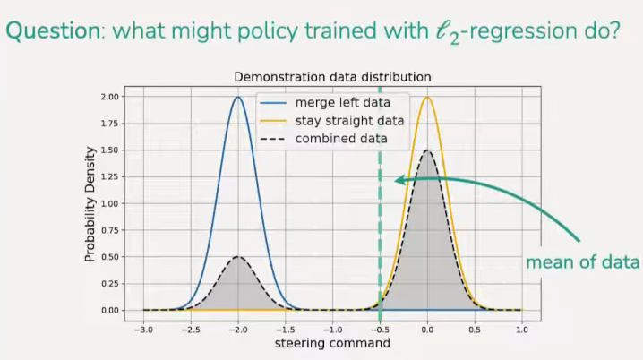

This essentially gives us a multimodal distribution, with two peeks, one going
straight, the other going left. And what happens when an
$\mathscr{l}_2$-regression is applied to this multimodal distribution is that it
will then predict the mean, which would fall inbetween the two actions (going
straight and merging left), and result in essentially drifting left, straddling
the line divisions on the road, and even from a mathematical standpoint, the
multimodal distribution straddles the probability of the two other distributions
(in other words veering slightly to the left is not a probabilistic outcome in
the demonstration set).

How often does this happen in practice?... All the time! Especially when data is
collected from multiple people.

## Learning _distributions_ with neural networks

In the previous example, we are essentially taking some external state,
inputting it into a Neural Network (NN) and outputting the mean action. Because
it is outputting the mean, this is technically hardly a distribution at all.
Instead, what we want is for the NN to output the parameters/distribution over
some probability of the action $p(a)$, which will allow us to capture more than
just the mean.

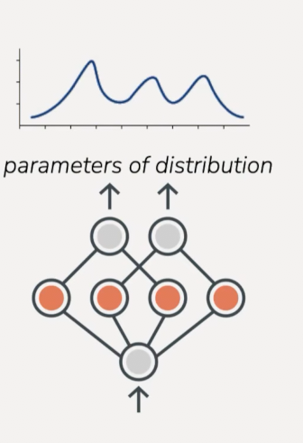

Let's now think of a few examples of what this might look like.

**1D discrete actions**

If your actions are not continuous, but instead they are discrete actions. So
let's say we're trying to train a policy to play a video game like Super Mario,
then the actions might be something like "up arrow", "down arrow", "press A",
"press B", something like that. What you can do is have the NN output this
categorical distribution over actions. In this discrete case, it will calculate
the probability of the first action, the probability of the second action, and
so forth. You can think of this as a classifcation problem. This distribution is
actually maximally expressive, what this means is that there isn't any
distribution over actions that this cannot represent, because it is a very
simple categorical example of a concrete set of predictable actions.
Unfortunately, much of the world is not 1D discrete actions, which is why we
need to think about how to model distributions over those actions.

**Continuous actions**

Moving onto continuous actions, this gets closer to a driving scenario, with
steering commands. The most nattural thing to do is to use a
[Gaussian Distribution](https://en.wikipedia.org/wiki/Normal_distribution). We
talked about outputting the mean of a Gaussian Distribution, which corresponds
to minimizing the squared error. But you can also have the NN output the
variance. Unfortunatley, if you have it output the variance in this particular
example, it won't output anything particularly helpful, it'll just output a
wider variance Gaussian to try and cover more probability mass. It's not very
expressive. So we want to be able to use distribution classes that are more
expressive so that we can try to ultimately get actions that are high
probability.

There are a lot of good questions in this section of the lecture. One of the
better questions here is whether or not we ever want to outperform the expert,
which actually is what RL is all about. There are methods where you curate the
dataset to contain more data that reflects the mode of some desired result, but
with Imitation Learning, generally everything we're trying to do is meet the
expert performance, and not exceeed it.

**Can we use generative modeling?**

One example of a generative model you may have seen is a _diffusion model_
(commonly recognized as image/video generation models), and one thing that is
really cool about diffusion models is that they are able to represent a very
diverse distribution over images, including images that are completely different
from one another.

Another ecxample of a generative model is an _autoregressive model_. You can
think of autoregressive models as essentially what happens with language
modeling where you're predicting one token or one word at a time. It is much
more powerful than outputting the mean distribution of a Gaussian distribution,
and much more powerful of outputting the categorical distribution over one
dimension (1D).

Thusly you can think of each of the previous examples respectively as:

learning $p(\text{image}\mid\text{text description})$

learning $p(\text{next word}\mid\text{words so far})$

These are very popular problems, but the underlying technique behind image
diffusion and autoregressive models is extremely general. You can use the same
idea for finding a distribution over actions given observations or given state.
So let's talk about how we might use these tools to learn that distribution.

**Generative models for policies**

Our goal is to approximate some action given some state:

approximating $p(\mathbf{a}\mid\mathbf{s})$

**Mixture of Gaussians**

One example to form a generative model that is simpler than others to understand
is a Mixture of Gaussians(GMM). The Mixture of Guassians is already more
expressive than a single Gaussian, in which we use a combination of Gaussian
distributions to model a single distribution.

a GMM will output
$(\mu_1, \sigma_1, w_1), (\mu_2, \sigma_2, w_2) \dots (\mu_n, \sigma_n, w_n)$

Where $\mu$ represents the mean, $\sigma$ represents the standard deviation, and
$w$ represents the weight of their respective Gaussians.

---

A student posed the question of "What does it mean for these distributions to be
more/less expressive?". The teacher responds with thinking of it as the number
of different distrubtion you can capture perfectly with that chosen
representation. If you only use a Gaussian, then you can only perfectly model
Gaussian distributions, whereas if you use a GMM, you can represent any single
Gaussian prediction model, but you can also represent any other distribution
that can be represented as a GMM. This means it is more expressive because it
can represent both a single Gaussian and a Mixture of Gaussians.

In some cases it can be difficult to compare two different distribution classes,
because some might be more or less expressive. But with GMM, it is strictly more
expressive than a single Gaussian.

---

**Discretize & Autoregressive**

Let's return to our driving example, but let's make it simple. Let's take our
first action is the steering angle, and the second action is the acceleration:

$$ [\text{steering}, \text{acc}] $$

So if we wanted to represent a distribution over these actions using an
autoregressive model, there's two things that we would want to do, the first
would be to discretize, and the second would be to formalize the autoregressive
model. Typically when we're using autoregressive mo,dels, it means that we're
going to be essentially predicting one dimension at a time. So we first want to
model a distribution over the first dimension of the action, what we would do is
in the case of steering, let's say we have:

$$ p(\text{steering}) $$

And we wanted our prediction to look like this:

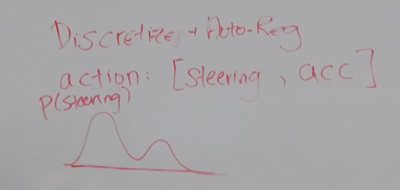

A Gaussian can't represent this. So instead we would discretize it by creating a
series of "bins" for all the different steering angles (dividing up the angle),
and then we would output a probability for each bin. when divided up, our graph
looks closer to something like a staircase:

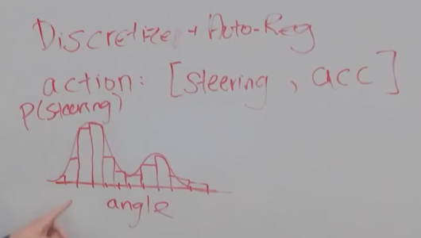

These bins are what we would use to approximate the original distribution. You
can choose how many bins you want to create. There is a trade off. The more bins
you have, the more granular and accurate your distribution becomes, with the
trade off being that there is more calculations to be done, and the more course
means less calculations, but also less accuracy.

Once you have outputted a distribution of the angle, then you would want to
output a distribution over the acceleration. In particular, in the case of
merging left vs going straight, you are probably more likely to have a stable
acceleration when going straight vs when merging left, where you are more likely
to be accelerating.

So, what we do now is we predict the angle:

$$ p(\text{angle}) $$

And then we will sample a streeing angle from this distribution:

$$ a_{t, 1} \sim p(\text{angle}) $$

And then we want to get the probability of a second dimension, conditioned on
the first dimension:

$$ p(a_{t, 2} \mid a_{t, 1}) $$

To do this, we will take our sampled action and pass it back into our model, and
then have our model output another distribution.

Let's say we took a steering angle that is more left:

$$ a_{t, 1} = -2 $$

This would be shown as having a distribution reflecting having a higher
acceleration:

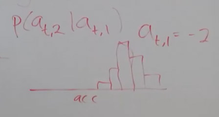

Contrasted with a steering angle that is just straight:

$$ a_{t, 1} = 0 $$

Then we would output a distribution as having a lower acceleration.

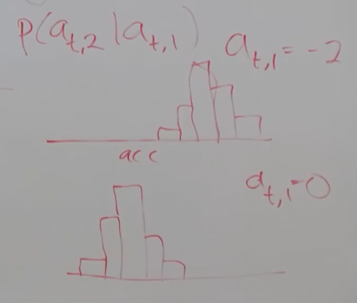

---

A student asks "How do you build your training data when you are discretizing
like this?"

To do this, you'll have the state-action pairs, you'll be sampling state-action
pairs, and in order to convert it into a discretized distribution, what you'll
do is sample a stat-action pair, and then you'll "bin" the action according to
your binning strategy, and then you'll apply a loss that is between the model's
predicted distribution and the sample action, which would be like one of these
bins. And the loss here you can actually just use the
[Cross-Entopy Loss Function](https://en.wikipedia.org/wiki/Cross-entropy#Cross-entropy_loss_function_and_logistic_regression).
Essentially what you are doing is a classification problem for each dimension of
your actions.

One other diagram that would be helpful here when thinking about this is that
when you have a model that's predicting actions, you often use a sequence model.
So, think about a sequence NN, something like a transformer or something like
that, you would pass as input your state $\mathbf{s}$, and then you are kind of
predicting the distribution over the first dimension of your action
$p(a_{t, 1})$. And then you sample over that distribution
$\hat{a}\sim p(a_{t,1})$, and then you'll pass this sampled action for your
chosen steering command $\hat{a_{t, 1}}$ back into your model and then output
the distribution over the next action, $p(a_{t, 2})$.

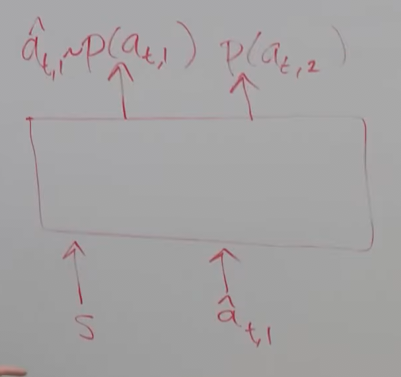

And this is exactly how language models work, where you'll have some sort of
beginning token, you'll predict a distribution over the next word, you'll sample
a word from that, and pass that word sample back into the model, and then
predict a distribution over the next word, except now we're doing it with
dimensions over our action sequence rather than over different words in a
sentence.

---

Another student asks "How do you determine the order of these different
dimensions?". In language models, it's very natural because there's a natural
ordering to words in a sentence, for example, although even across different
languages, there's some variation there. It's something that generally you kind
of pick by hand, you could also in some cases treat it as a hyperparameter. In
other cases, there might be also somewhat natural choices for the ordering. So
if you're controlling a robot arm, for example, you can go down what's called
the kinematic chain of a robot arm where you start with the base dimension and
you go to the next joint, and the next joint, and so forth. The good news is
that in principle the kind of the expressive power of this distribution doesn't
change with the order. Essentially your goal is trying to represent the full
joint distribution over all dimensions. The only reason why you're doing kind of
an ordering here is because if you tried to represent a joint distribution over
all the dimensions at once, there's a lot of kind of pair-wise probabilities
that you'd have to predict and it's a lot more efficient to do it one more
dimension at a time to represent the full joint.

---

One of the reasons to use discretizing is that it allows us to model multi-modal
distributions. The binning of the distribution allows us to things that are way
more expressive than a mixture of Gaussians up to how fine your discretization
is. The challenge with discretization is let's say we have a lot of bins, let's
say we had 100 bins for one dimension, and yoiu're trying to represent a 10
dimensional action, than the dimensionality of your discretized actions is going
to blow up if you try to model that 10<sup>5</sup> matrix over probabilities. So
using an autoregressive model helps you deal with that dimensionality. You could
in principle use an autoregressive model with a mixture of Gaussians, for
example. That would be completely fine as well. It's not a common choice, per
say, because if you're going to go through the troulbe of using a discretization
model, usually discretization is a pretty powerful choice, but yeah, you can use
it with a Guassian or Gaussian Mixture model or something like that.

---

So another student asks how we actually go about training this? So let's walk
through that.

0. Given some data set $\mathscr{D} := \{(\mathbf{s}, \mathbf{a})\}$

We want to train our NN, so first we have to sample an example from the dataset,
or to sample a minibatch of examples. Here we'll write it out for a minibatch
size of one, just for simplicity, but you can kind of extend it.

1. Sample $(\mathbf{s}, \mathbf{a}) \sim \mathscr{D}$

Once we sample this, we will essentialy be running a forward pass through our NN
and a backward pass through our NN. The key question that comes up is that,
well, doing the forward pass is fairly straight forward, and when we do the
forward pass, we'll be getting back some kind of probability over the actions of
each dimension, and we need to figure out what the objective should be. There
actually is a common objective we can think of for all these generative models,
and that objective is that we're outputting these kind of probability
distributions, we want to be maximizing the probability of the actions
represented in the data. Equivalently, we'll write this as minimizing the log
probability of our policy of $\mathbf{a}$ given $\mathbf{s}$.

$$ \min_\theta - \log \pi_\theta(\mathbf{a}\mid\mathbf{s}) $$

What this means is that we're going to be evaluating how likely is the action
that wa sampled under our policy. Then, we'll be trying to make the probability
of the action in the data set as high as possible or the negative log
probability as low as possible. In practice, what this log probability looks
like is going to be different for different models. For a GMM, what you can do
is write down the
[probability density function](https://en.wikipedia.org/wiki/Probability_density_function)
for a GMM and then just differentiate with respect to the mean variance and
weight that is outputted by the NN.

For the case of a the autoregressive model, it's a little bit different. So what
this looks like for the autoregressive model, we essentially get our
probabilities:

$$ p(a_{t,1}), p(a_{t,2}), \dots $$

The first probability $p(a_{t,1})$ will just be the
[Cross-Entopy Loss](https://en.wikipedia.org/wiki/Cross-entropy#Cross-entropy_loss_function_and_logistic_regression)
that corresponds to trying to maximize the log probability of the value of
$a_{t,1}$ for a discrete categorical variable. For the second dimension, that is
where this gets more complicated, the first part of the second variable:

$$ p(a_{t, 2} |) $$

This will be the
[Cross-entropy Loss](https://en.wikipedia.org/wiki/Cross-entropy#Cross-entropy_loss_function_and_logistic_regression),
but you need to figure out which action you want to use for the second part:

$$ | a_{t_1}) $$

Oftentimes, you will use the action in the dataset.

For the inputs ,you'll often actually pass as input the state, and the
dimensions that were chosen in the dataset, and then for each of the subsequent
probabilities, you'll be applying the
[Cross-entropy Loss](https://en.wikipedia.org/wiki/Cross-entropy#Cross-entropy_loss_function_and_logistic_regression),
and back propogating the Cross-Entropy Loss back into the NN. Then, at test
time, you'll then actually be using your own predictions, and passing your own
predictions into the NN.

That said, this is really the core loss function:

$$ \min_\theta - \log \pi_\theta(\mathbf{a}\mid\mathbf{s}) $$

And this corresponds to a form of Cross-Entropy loss for discretized
distributions and for GMM you write down the PDF and differentiate.

---

So the next question was it seems a little odd to discretize and do a
categorical distribution over a continuous variable especially considering that
a loss function like cross entropy won't take into account the fact that two
bins are like, that sort of error, is probably less costly than an error that is
for two bins that are very far apart from one another.

This is one downside to using descritized actions. In practice, often that sort
of distance is something that is fairly quick to learn. And so the outcome is
often still pretty good, but you might need more data and how fine your
discretization is a really important hyperparameter, because if it's too fine,
then it'll be very hard to get signal, because if you're off by 1, you'll get a
zero loss function. There are also other things you can do to try to smoothen
out the data, and smoothen out the labels, so that the label isn't just a one
hot vector. You can kind of smooth around it a little bit. So that's one thing
that can also help with that, but it's a little more advanced.

---

So how does back propogation handle this when it's discrete? Only the output is
discreet. You can think of it as a classification problem, and so if the weights
are discrete, that's bad for back propogation, but when it's only at the labels,
you're only computing the loss function on those discrete variables. And then
that loss, well, you can back propagate in a direct way. That's because you're
comparing the output, it's outputting a probability, and computing a loss on
that probability, and then you can back propogate that loss on that probability.
So the outputs are still continuous values because you're outputting the height
of each of the bins.

Here is a visualization of this discretized case:

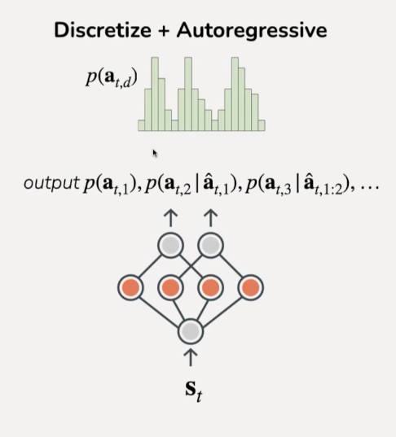

**Diffusion**

The last example of generative models for policies is diffusion. In this we mean
diffusion over actions instead of diffusion over images. It can model very
complex distributions over continuous variables including high dimensional
continuous variables like images or actions. It does so by using this kind of
denoising process where you start with complete noise and denoise it iteratively
to make it a less and less noisy version of the action to hopefully ultimately
generate a clean action prediction.

It is worth noting that both discretize and diffusion models do have a sort of
iterative process. In the case of autoregressive models, it's iterative over the
dimensions of your prediction. And in the case of diffusion, it's iterative over
this denoising process.

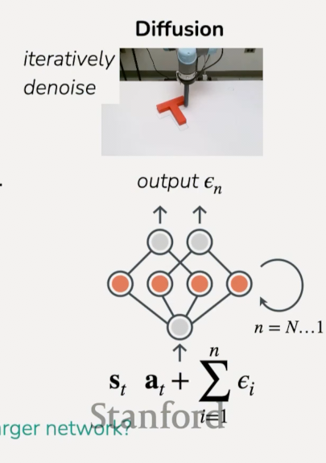

So, let's pose a simple question now, why don't we just make the NN larger?

Let's take our $\mathscr{l}_2$-regression example from before. Recall that we
only got the mean from this prediction, we didn't actually get a desired result.
Despite increasing the size of our NN, we would only, in this case, get the same
answer, the mean. We might get a more accurate calculation of that mean, but
that's it. It doesn't actually represent a more complex distribution.

So, the expressive power of a distribution you are trying to represent is in
many ways separate from the expressive power of the function itself. If you
think on the concept of a NN, the outputting of parameters of a distribution,
there's the expressive part of the function of the NN, and then think on how
many functions can you represent that go from $\mathbf{s}$ to parameters
$p(\mathbf{a})$. Then there is also the expressive power of how many different
distributions can those parameters even represent in the first place?

This is a really important point, where NN expressivity is often distinct from
distribution expressivity. The expressivity of the outputted distributions that
it can represent is kind of captured by what kind of distribution you're
allowing it to represent, and if it only outputs the mean variance, it can very
expressively functions that go from state to mean and variance, but it can't
represent anything more complex than a Gaussian.

**Imitation learning - version 1**

Expressive policies

Okay, so we've walked through this a bit already, let's review:

0. Given demonstrations collected by an expert
   $\mathscr{D} := \{(\mathbf{s}_1, \mathbf{a}_1, \dots, \mathbf{s}_T)\}$

1. Train **generative model** of the expert's actions

$$ \min_\theta - \mathbb{E}_{(\mathbf{s}, \mathbf{a}) \sim \mathscr{D}}\left[\log \pi_\theta(\mathbf{a}\mid\mathbf{s})\right] $$

with expressive distribution $\pi(\cdot \mid \mathbf{s})$

This equation might look a little complicated, but let's break it down, The
$\log \pi_\theta$ is the log probability under the policy, the
$(\mathbf{s}, \mathbf{a})\sim\mathscr{D}$ and the $\mathbf{a}$ in the argument
are the demo actions that are sampled from the demonstration data set. And this
probability is under the policy that we're trying to learn.

In essence, we are trying to maximize the log probability of the demo actions
under the policy.

2. Deploy learned policy $\pi_\theta$

When we deploy this, we should have a policy that is actually matching what the
expert is doing and as a result it should be better at performing the test.

**Imitation learning - version 1 vs version 0**

Here, the instructor goes through some examples comparing single huamn to multi
human simulated transport task and also a real shirt hanging task by two robot
arms. I'll simply leave the image here for consideration:

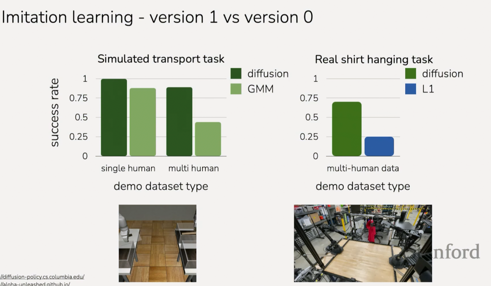

**Robotics: Imitaiton learning + expressive policies**

Physical Intelligence $\pi_0$

https://www.youtube.com/watch?v=YyXCMhnb_IU

NVIDIA Gr00t N1

https://youtu.be/unnkmL6QJ78?feature=shared

Figure Helix

https://youtu.be/Z3yQHYNXPws?feature=shared

OpenVLA

https://openvia.github.io/

**Autonomous driving: Imitation learning + expressive policies**

Waymo EMMA

https://waymo.com/blog/2024/10/introducing-emma/

Wayve LINGO-2

https://wayve.ai/thinking/lingo-2-driving-with-language/

**Summary so far**

- Data from one consistent demonstartor

  - Unimodal policy distribution

- Multimodal data, e.g. from multiple demonstrators

  - Need expressive generative model for policy

- **Key Idea**: Train expressive policy class via generative modeling on dataset
  demonstrations.

- Algorithm is fully _offline_

**Definitions**:

_offline_: using only an existing dataset, no new data from learned policy

_online_: using new data from learned policy

- no need for data from policy (online data can be unsafe, expensive to collect)

- no need to define a reward function

- may need **a lot** of data for reliable performance

**What can go wrong in imitation learning?**

For this it's helpful to look at Supervised Learning. So in supervised learning
we have some data and it's usually kind of trained from one data set that stays
fixed and the inputs to the model are completely independent from the
predictions that the model makes. Now, this all changes in imitation learning.

As each state takes an action up a change, we are trying to mimick this
demonstration.

```
s_1 --- a_1 ---> s_2 ---- a_2 ----> s_3 ...
```

If you are trying to mimic it, and you roll out your policy from the very first
state $\mathbf{s}_1$, and maybe your prediction distribution is doing pretty
well, and then at some point it'll make a mistake. At this point where it is
very far from the actual distribution, it's possible it doesn't have much data
from where it ended up after it made this mistake (even if it was a small
mistake). This is because potentially it is under-represented in the data. In
fact, if it's under-represented, it's actually even more likely to make a
mistake in the future. So, if it's more likely to make a mistake, it might
actually drift away from the distribution even more, and from there maybe it
makes an even bigger mistake.

This is often referred to as "compounding errors". As a result of this, the
distribution of states that are visited by your policy is actually different
from the distribution of states that is visited by the expert. And this differs
fundamentally from Supervised Learning.

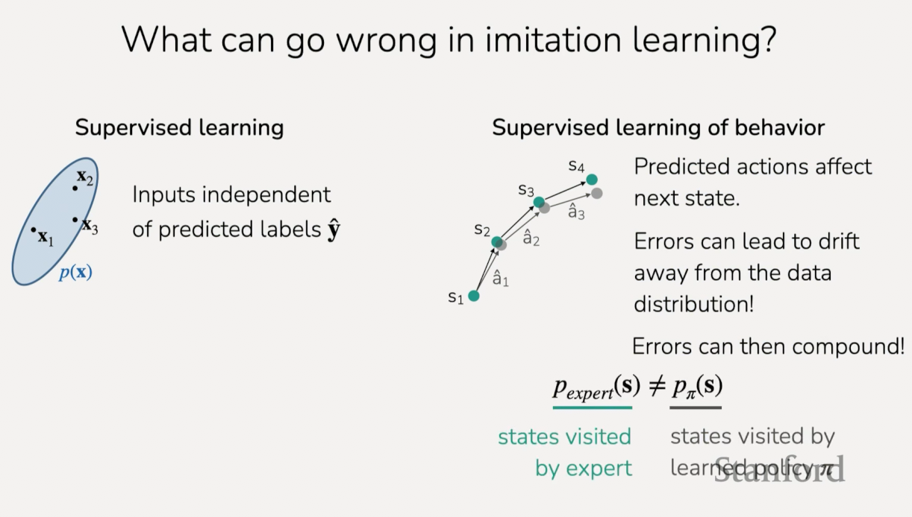

The amount of difference betwen the distribution of states that are visited by
the policy and the distribution of states that are visited by the expert is what
is known as "covariate shift".

So how can we address this?

**Solutions?**

1. Collect A LOT of demo data & hope for the best.

If you have the capacity to do this, it's actually nhot a terrible solution. But
there's also some other solutions.

2. Collect corrective behavior data

One of the key solutions is to try and collect **corrective** data. This
essentially means that if the policy distribution shifts a certain amount from
the expert distribution, to feed them the actual expert distribution data as a
corrective behavior, essentially saying "hey, you're all the way over here, but
the actual distribution is over here, so just go here next time." Done
iteratively, you can combine this corrective data with the expert distribution
data, and then train the policy on that combined data.

Does this potentially overfit the model? Yes, but this means you'll need to
collect data in very diverse scenarios and not just very narrow scenarios.

So what does this look like as an algorithm?

1. Roll out learned policy

$$ \pi_\theta : \mathbf{s}'_1, \hat{\mathbf{a}}_1, \dots, \mathbf{s}'_T $$

2. Query expert action at visited states

$$ \mathbf{a}^* \sim \pi_{\text{expert}}(\cdot \mid \mathbf{s}') $$

Note that you can think of $\mathbf{a}^*$ can be thought of as the corrective
actions.

3. Aggregate corrections with existing data

$$ \mathscr{D} \leftarrow \mathscr{D} \cup \{(\mathbf{s}', \mathbf{a}^*)\} $$

4. Update policy

$$ \min_\theta \mathscr{L}(\pi_\theta, \mathscr{D}) $$

This can be a repetitive process, where the updated policy makes new mistakes,
and so the process is repeated again until the desired result is achieved. This
process is known as "dataset aggregation" (DAgger).

- +data-efficient way to learn from an expert
- -can be challenging to query expert when agent has control

Sometimes getting corrective data is hard or not possible. In that case another
way we can address compounding errors is to intervene entirely, in which the
expert distribution force corrects the policy distribution to match the expert.
Once this is done, we collect corrective behavior data while taking _full
control_.

1. Start to roll out learned policy

$$ \pi_\theta : \mathbf{s}'_1, \hat{\mathbf{a}}_1, \dots, \mathbf{s}'_T $$

2. Expert intervenes at time $t$ when policy makes mistak

3. Expert provides partial demonstration

$$ \mathbf{s}'_t, \mathbf{a}^*_t, \dots, \mathbf{s}'_T $$

4. Aggregate new demos with existing data

$$ \mathscr{D} \leftarrow \mathscr{D}\cup\{(\mathbf{s}'_i, \mathbf{a}^*_i)\}; i \geq t $$

5. Update policy

$$ \min_\theta \mathscr{L}(\pi_\theta, \mathscr{D}) $$

This is what is known as the "human gated DAgger"

- +(much) more practical interface for providing corrections
- -can be hard to catch mistakes quickly in some application domains
