# Lecture 4: Actor-Critic Models

## Recap of Last Time

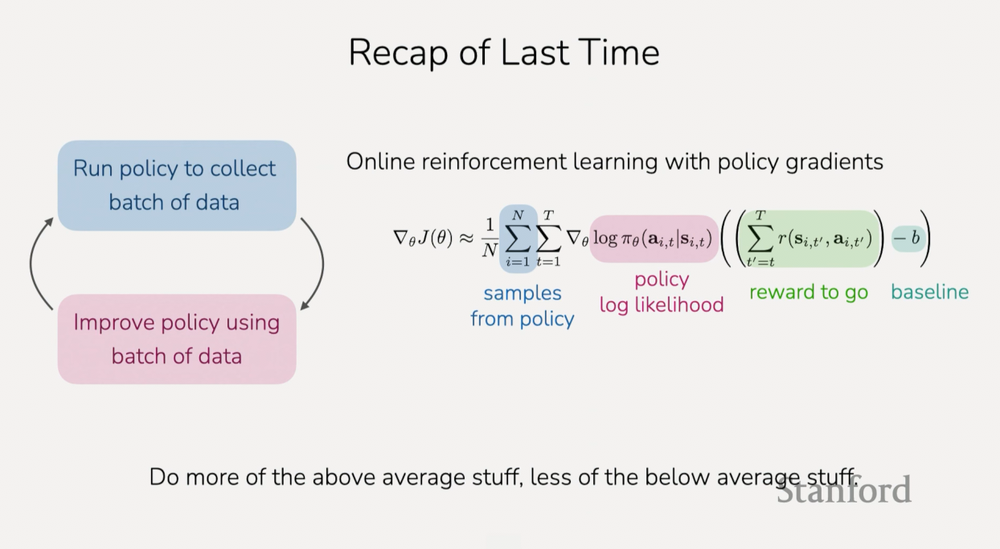

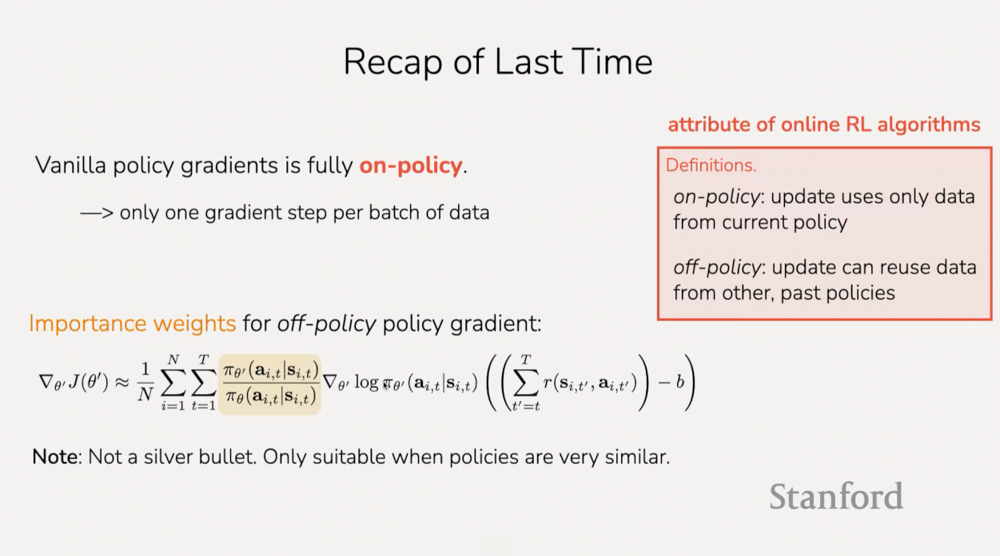

## The plan for today

**Actor critic methods**

1. Improving policy gradients

2. How to estimate the value of a policy

   a. Sample & directly supervise

   b. Use your own estimate

   c. Something in-between?

3. Off-policy actor-critic

   a. Importance weights & constraining step size

   b. Full off-policy version with replay buffers

**Key learning goals:**

- How to estimate how good a state and action is for a policy

- How to use those estimates to form a more efficient RL algorithm

## Revisiting Some Useful Objects

To understand these new methods, it'll be useful to reviist some useful objects
that we talked about in the first lecture, specifically this value function:

_value functdion_ $V^\pi(s)$ - future expected rewards starting at $s$ and
following $\pi$

A value function is representing how good a state is if you're going to follow a
policy starting from that state. You can think of it as the sum of rewards
starting from some state:

$$ V^\pi(s) $$

And this means that we are going to be starting at state $s$, and then running
$\pi$. And for a given state:

$$ V^\pi(s_t) $$

This si equal to the sum of rewards if we were to start at state $t$, and go to
the end of the trajectory, $T$. And here is the sum of the rewards (written in
shorthand from the previous lecture):

$$ V^\pi(s_t) = \sum_{t'=t}^{T}{r(s_{t'}, a_{t'})} $$

Now, the sum of rewards $r(s_{t'}, a_{t'})$, is going to differ depending on
what state we start at $s_t$, and also depending on what policy $\pi$ that we
are running. So therefore this is going to be an expectation $\mathbb{E}$ over
the states-actions $s_{t'}, a_{t'}$ that will be visited under our policy $\pi$,
conditioned on the fact that we are starting on the state $s_t$:

$$ V^\pi(s_t) = \sum_{t'=t}^{T}\mathbb{E}_{(s_{t'}, a_{t'}) \sim \pi}\left[{r(s_{t'}, a_{t'})} | s_t\right] $$

Conceptuially, if you have some trajectory, and you are thinking about the value
of some state, you can think of it as, if we were to collect a lot of different
trajectories starting from that state, from our policy, and then we just summed
up the rewards from this timestep to the end, and then averaged over these
trajectories, that would define the value of the state, or how good the state is
for the policy.

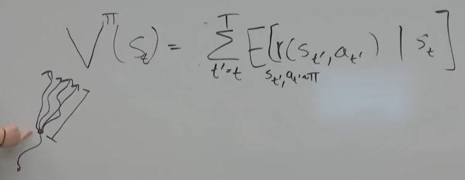

Another useful quantity that we'll be making use of is called the Q function.
And this is slightly different from the value function, but very closely
related.

_Q-function_ $Q^\pi(s, a)$ - future expected rewards starting at $s$, taking
$a$, then following $\pi$

The difference is that instead of just thinking about the value of the given
state, we're going to be thinking about a value of a given state and action.
What this is referring to is if you were to instead of just starting at $s$ and
running $\pi$ from there, instead if you were to start at $s$, take a particular
action $a$, and then run the policy $\pi$, we then ask what is our expected sum
of rewards?

So then you can think of this as instead of something like our previous image,
consider first that we take some given state $s$, and first we take some given
action $a$, this action could also lead to different states because the
environment is stochastic and then it's the sum of these rewards on average:

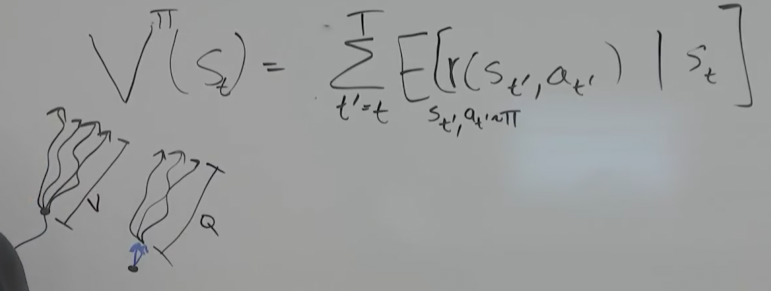

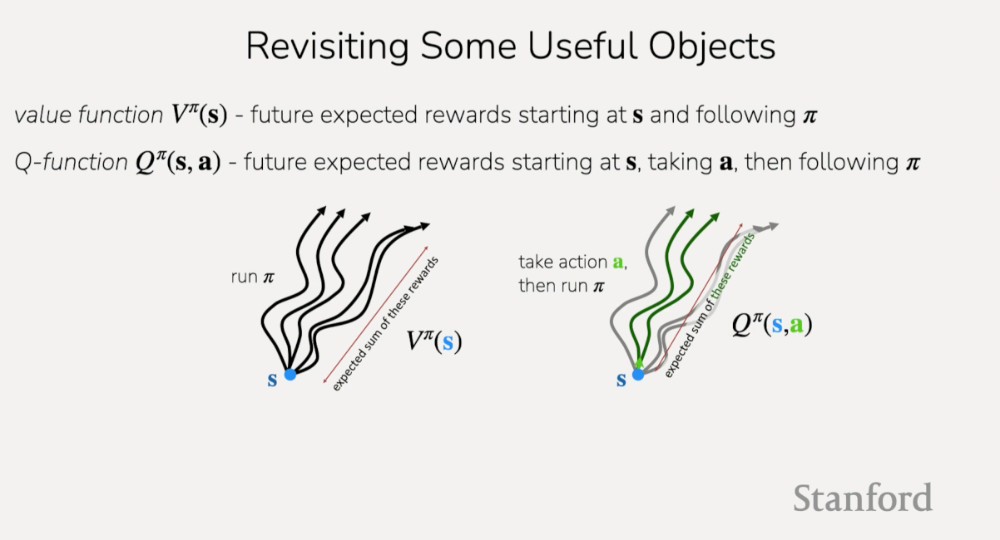

Now one last thing that's useful to think about in terms of how these two relate
to each other is that you can think of the value of a state as, if you take an
expectation of the action that the poicy would have taken, you can think of it
as the average, or the expectationm of the Q-values over all the actions that
the policy would have taken.

$$ V^\pi(s) = \mathbb{E}_{a \sim \pi(\cdot|s)}\left[Q^\pi(s, a)\right] $$

And now one last object that we'll use today is thinking about how good is a
particular action relative to other actions that we might take?:

_advantage_ $A^\pi(s, a)$ - how much better is it to take $a$ than to follow
policy $\pi$ at state $s$

$$ A^\pi(s, a) = Q^\pi(s, a) - V^\pi(s) $$

So, if you consider the Q-value minus the Value function, that's going to tell
you how good is it to take action $a$ versus following the pol.icy at a given
state? In essence, what is the _advantage_ of taking one action vs folling the
policy?

---

One student asks a good question that if it's possible to find $Q^\pi$, so that
we can go from our Value Function to useful relation from the slide? Meaning can
we go from:

$$ V^\pi(s_t) = \sum_{t'=t}^{T}\mathbb{E}_{(s_{t'}, a_{t'}) \sim \pi}\left[{r(s_{t'}, a_{t'})} | s_t\right] $$

To:

$$ V^\pi(s) = \mathbb{E}_{a \sim \pi(\cdot|s)}\left[Q^\pi(s, a)\right] $$

By defining $Q^\pi$? And yes we can it is:

$$ Q^\pi(s_t, a_t) = \sum_{t'=t}^{T}{\mathbb{E}_\pi\left[r(s_{t'}, a_{t'}) | s_t, a_t\right]} $$

So here we define some Q-value for some policy $\pi$, as a sum of all future
trajectories over the expected sum of rewards for the policy $\pi$give the state
and action at that trajectory.

And in terms of seeing how to get between these two definitions of the Value
functdion, you can think of our first Value function as having an expected sum
of rewards for future actions sampled from the policy, whereas in the $Q^\pi$
equatioin written above, you can think of it as not having all actions sampled,
but rather all future examles sampled from $\pi$. In the case for $Q^\pi$, we're
sampling from the action as provided as input, whereas in the $V^\pi$ case, we
are sampling from the policy.

---

## Example

Say that you are a person, a state of being called $s_t$, and you really want to
learn how to play the drums. Your reward is $1$ if you can play it in a month,
and $0$ otherwise. So $T$ is a month from now. And your action space, you have
three different possible actions in your action space. One action is to sit on
the beach $a_1$, another action is to watch tv $a_2$, and another action is to
practice playing the drum $a_3$.

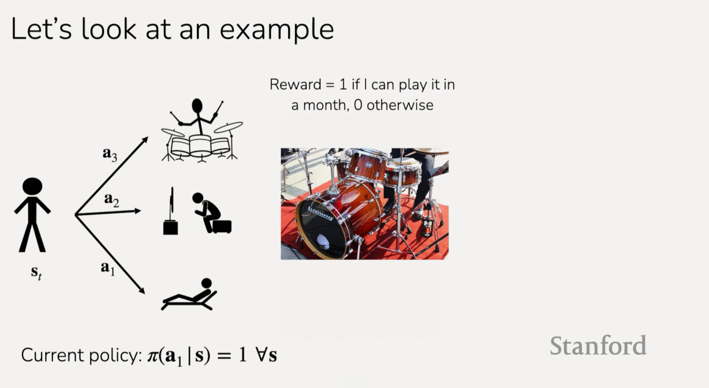

And say that your current policy is just to sit on the beach, and you do that
for all states:

Current policy: $\pi(a_1 | s) = 1 \forall s$

Now, a question to think about is what are each of these quantities for the
action of $a_1$, for the action of $a_2$, and for the action of $a_3$.

For each action, what are these?

Value function: $V^\pi(s_t) = \text{?}$

Q function $Q^\pi(s_t, a_t) = \text{?}$

Advantage function: $A^\pi(s_t, a_t) = \text{?}$

What does your intuition tell you in regards to these as they relate to $a_1$,
sitting at the beach?

You'd assume that the Value function is $0$ because the person would not learn
to play the drums. So that's the sum of expected rewards for this policy.

For the Q-function, if you sit on the beach at the current time step or watch TV
at the current time step, the Q-function will be zero for those actions. Whereas
if the Q-function for playing the drums at the current timestep would be $1$ if
that amount of practicing is sufficient. It's also possible that it would be a
bit lower than $1$, if you for example practiced for an hour and the sat on the
baech by following the policy afterwards. It depends a little bit on how long a
given time step is.

Then the advantage function is going to be $Q - V$. And so it's going to be a
positive number for the action of practicing, and it'll be $0$ for the other two
actions.

## What is dissatisfying about policy gradients?

Recall our original slide:

Let's see how we can use value functions to make this algorithm better.

In our previous lecture, we talked about some scenarios that were dissatisfying
about policy gradients. The first was that if we are trying to learn how to
walk, and we have a policy that takes a small step forwards and then falls
backwards, we will push down the likelihood of taking a step forwards, because
we don't necessarily know what might have led it to fall backwards.

Now, if we actually had some understanding that taking a small step forwards was
actually good, was making progress, was actually advantageous, then we might be
able to actually increase the likelihood. This is starting to hint at some of
the intuition bwehind Actor-Critic methods.

Likewise, we talked about an example of trying to fold a jacket, and we found
that if you have a sparse reward where you only do part of the task, like only
folding the sleeves, or flattening the jacket but not folding it, you aren't
really utilizing the trajectories that are getting zero reward, and similar to
the other case, if we understood that these actions are advantageous for making
progress on the task, then we might be able to figure out how to use these
trajectories in a positive way.

To summarize, policy gradients don't always make efficient use of the data we
have collected. If we can try to figure out what actions are advantageous vs not
advantageous, we might be able to make better use of that data.

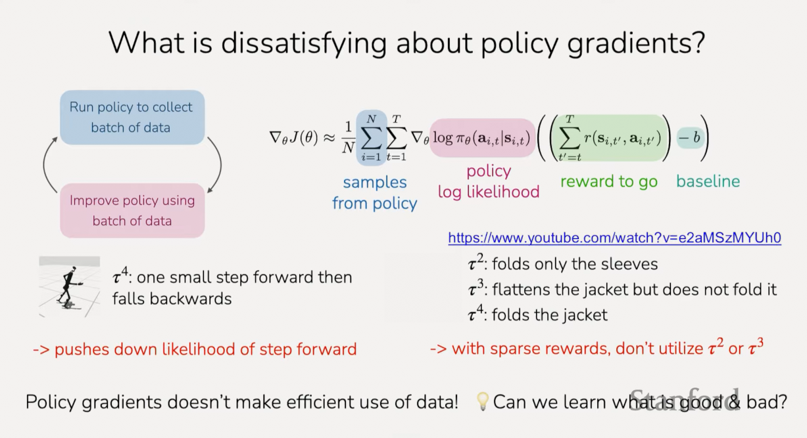

## Improving policy gradients

Estimating reward to go

$$ \nabla_\theta J(\theta) \approx \frac{1}{N}\sum_{i=1}^{N}{\sum_{t=1}^{T}{\nabla_\theta\log\pi_\theta(a_{i, t} | s_{i, t})\underbrace{\left(\sum_{t'=t}^{T}{r(s_{i, t'}, a_{i, t'})}\right)}_{\text{"reward to go"}}}} $$

So a lot of what we are going to focus on today is this "reward to go" piece.
This is actually what is telling us if we have negative rewards in the future.
It represents the estimate of future rewards if we take $a_{i, t}$ in state
$s_{i, t}$.

So if we recall this visualization from before:

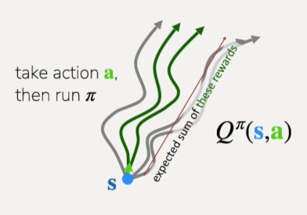

And if we think about this picture, we were looking at this quantity in terms of
what we observed in trajectories. But what would be an even better version of
this quantity would be to use the Q-function. If we could replace this "reward
to go" with our Q-function, then we would be able to get a much better
estimateof whether we should push up the likelihood or we should push down the
likelihood.

So instead of running the policy given some states and summing together the
rewards, if instead we would run the policy many many times, and get a Q
function (which again, considers future states and actions based off the current
state in the timestep) for this state, that would return the _true_ expected
rewards to go under the expectation of our policy. This would be way better.

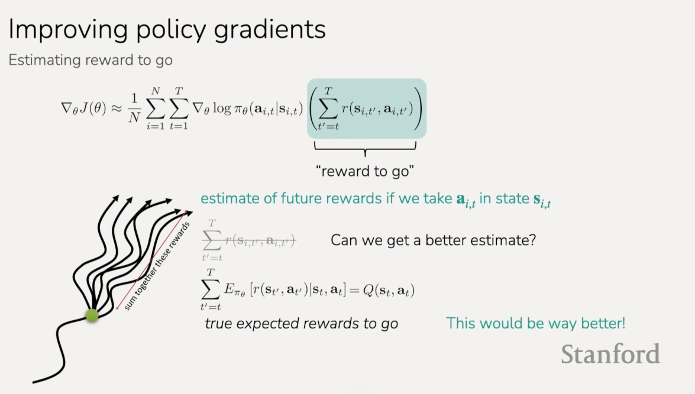

This leaves us with a better form of the gradient equation, which looks like
this:

$$ \nabla_\theta J(\theta) \approx \frac{1}{N}\sum_{i=1}^{N}{\sum_{t=1}^{T}{\nabla_\theta\log\pi_\theta(a_{i, t} | s_{i, t})Q(s_{i, t}, a_{i, t})}} $$

Where we increase the likelihood of the actions for things that have high
Q-values and we decrease the likelihood of the actions for things that have low
Q-values.

**What about baselines?**

$$ \nabla_\theta J(\theta) \approx \frac{1}{N}\sum_{i=1}^{N}{\sum_{t=1}^{T}{\nabla_\theta\log\pi_\theta(a_{i, t} | s_{i, t})Q(s_{i, t}, a_{i, t})}} $$

In the previous lecture, we did talk about baselines, which represents some
constant that is the average reward. The question is, should we use a baseline
here?

$$ \nabla_\theta J(\theta) \approx \frac{1}{N}\sum_{i=1}^{N}{\sum_{t=1}^{T}{\nabla_\theta\log\pi_\theta(a_{i, t} | s_{i, t})\left(Q(s_{i, t}, a_{i, t}) - b\right)}} $$

So, before this, the basselines were the average reward. In this case if we were
to introduce baselines, we could think about what we might use.

In this case, we could use the average Q-value.

$$ b = \text{average reward} = \frac{1}{N}\sum_{i=1}^{N}{Q(s_i, a_i)} $$

And hopefully you can see that this is starting to look alot like the Value
function.

$$ V^\pi(s_t) = \mathbb{E}_{a_t\sim\pi(\cdot|s_t)}\left[Q^\pi(s_t, a_t)\right] $$

And so, a natural baseline would actually be to use the value function. This
leaves us with our updated equation as:

$$ \nabla_\theta J(\theta) \approx \frac{1}{N}\sum_{i=1}^{N}{\sum_{t=1}^{T}{\nabla_\theta\log\pi_\theta(a_{i, t} | s_{i, t})\left(Q(s_{i, t}, a_{i, t}) - \cancel{b}\right)}} $$

$$ \nabla_\theta J(\theta) \approx \frac{1}{N}\sum_{i=1}^{N}{\sum_{t=1}^{T}{\nabla_\theta\log\pi_\theta(a_{i, t} | s_{i, t})\left(Q(s_{i, t}, a_{i, t}) - V^\pi(s_t)\right)}} $$

And also recall that $Q - V$, is what the advantage function is:

$$ A^\pi(s_t, a_t) = Q^\pi(s_t, a_t) - V^\pi(s_t) $$

And so, putting this together we have:

$$ \nabla_\theta J(\theta) \approx \frac{1}{N}\sum_{i=1}^{N}{\sum_{t=1}^{T}{\nabla_\theta\log\pi_\theta(a_{i, t} | s_{i, t})A^\pi(s_{i, t}, a_{i, t})}} $$

And so putting this together we would be increasing the likelihood for actions
that have a high advantage and decreasing the likelihood for actions that have a
low advantage.

If we think back to the example of learning to practice playing the drums, we
would now be implementing that the action of practicing had a high advantage
relative to the current policy. So then we would increase the likelihood of
practicing, and decrease the likelihood for the other actions.

Another way to think about this is that better estimates of $A$ lead to less
noisy gradients! If we knew the true value of the advantage function, then we
would be able to get a very good gradient. Unfortunately, we don't know the true
advantage function, and so the next question we'll go over the next several
slides is how can we estimate the advantage function.

## Online RL Outline

$$ \nabla_\theta J(\theta) \approx \frac{1}{N}\sum_{i=1}^{N}{\sum_{t=1}^{T}{\nabla_\theta\log\pi_\theta(a_{i, t} | s_{i, t})\underbrace{A^\pi(s_{i, t}, a_{i, t})}}} $$

First: Initialize the policy (randomly, with imitation learning, with
heuristics)

As the algorithm is concerned, recall that we had this loop of running the
policy and improving it:

1. Run policy to collect batch of data

2. Improve policy

3. Repeat

Now we have an additional step:

1. Run policy to collect batch of data

2. Fit model to estimate expected return

3. Improve policy

4. Repeat

This additional step of fitting the model is basically this attempt to estimate
$A$. This estimated expected return will then in trun be used to improve the
policy $\theta \leftarrow \theta + \nabla_\theta J(\theta)$. This step will
involve either estimating $V^\pi$, $Q^\pi$, or $A^\pi$.

## Estimating expected return

$$ \nabla_\theta J(\theta) \approx \frac{1}{N}\sum_{i=1}^{N}{\sum_{t=1}^{T}{\nabla_\theta\log\pi_\theta(a_{i, t} | s_{i, t})\underbrace{A^\pi(s_{i, t}, a_{i, t})}}} $$

To start out, we have to find out how can we actually get to $A^\pi$.

Should we fit $V^\pi$, $Q^\pi$, or $A^\pi$?

You could try to just fit $A^\pi$, though it's actually a little bit challenging
to get direct supervision for the advantages. So we're actually going to try to
fit $V^\pi$, and the way we're going to get there is we know that:

$$ A^\pi(s_t, a_t) = Q^\pi(s_t, a_t) - V^\pi(s_t) $$

So, one option is we could try to estimate both $Q$ and $V$, but then we'd still
have to estimate two objects ($s_t$, $a_t$). So there's actually a way to turn
this equation that only depends on $V^\pi$. This is nice, because then we can
only fit $V^\pi$ and then only derive $A^\pi$ from there to get the gradient.

To do this, we can think about $Q^\pi$. This Q-function is the value of starting
at $s$, taking $a$, and then summing the rewards. So you can think of it as:

$$ r(s_t, a_t) + \mathbb{E}_{s_{t+1} \sim p(\cdot | s_{t}, a)} \left[\right] $$

Then after this state $s_t$, it's essentially going to be the sum of rewards
starting at $s_{t+1}$ and following your policy. And the sum of rewards at
$s_{t+1}$, that's equal to the value function of $s_{t+1}$.

$$ r(s_t, a_t) + \mathbb{E}_{s_{t+1} \sim p(\cdot | s_{t}, a)} \left[V(s_{t+1})\right] $$

This represents the Q-value as the reward at the current time step plus the
value at the time step after that.

Now, we can't sample these dynamics $s_{t+1} \sim p(\cdot | s_{t}, a)$. But we
when we ran our policy to collect data, we did actually see one outcome, one
$s_{t+1}$, and so we can approximate this as:

$$ \quad \approx r(s_t, a_t) + V(s_{t+1}) $$

the reward at the current timestep plus the value at the next timestep.

And then if we want to estimate the advantage, we can write it as the reward at
the reward at the current timestep plus the value at the next timestep minus the
value at the current timestep.

$$ A^\pi(s_t, a_t) \approx r(s_t, a_t) + V^\pi(s_{t+1}) - V^\pi(s_t) $$

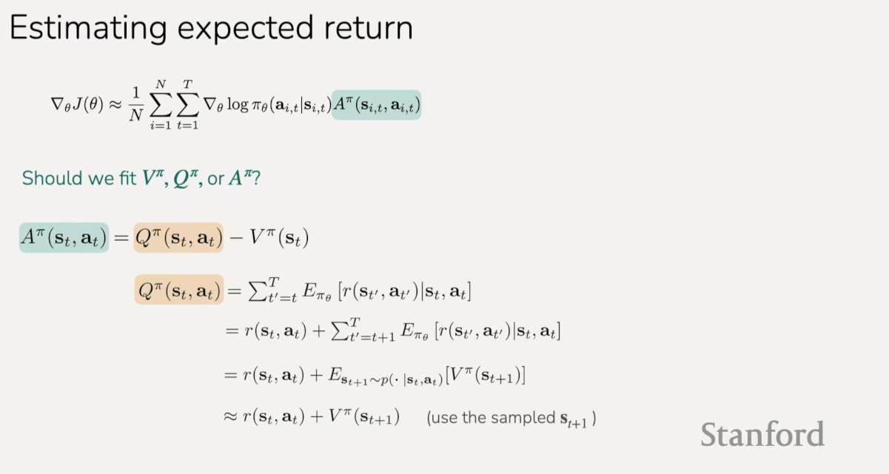

---

So how good of an estimate is this? Keep in mind that we are just taking a
single sample from a future state. If our dataset is deterministic and not
stochastic, then this method produces a good estimate because we have a more
fixed, and usually smaller dataset. If it is stochastic, then this approximation
becomes less accurate (correlated with the size of the dataset and how dynamic
it is?).

So now we are will move on to how do we actually fit $V^\pi$.

In the following illustration, we can represent $V\pi$ as a NN.

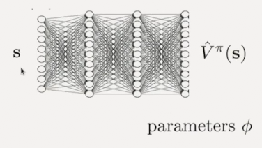

Where we pass as input, a state, and then it wil output a single scalar value,
not as pictured here, but rather as a scalar vlue that represents the value of
that state for that policy. This neural network will have some parameters.

## Estimating $V^\pi$

There's a few different ways to estimate $V^\pi$.

$$ V^\pi(s_t) \approx \sum_{t'=t}^{T}{r(s_{t'}, a_{t'})} $$

Recall that in our original vanilla version of Policy Gradients, we just used a
single trajectory, a single sample. Instead of actually learning a model, we
just used that sample. In principle, we could also use many samples:

$$ V^\pi(s_t) \approx \frac{1}{N}\sum_{i=1}^{N}{\sum_{t'=t}^{T}{r(s_{t'}, a_{t'})}} $$

Unfortunately, if you were to try to go to a particular state and then take many
samples from that state, that means that you would have to be able to reset the
"world" to that state, and see what happens if you took many different rollouts
from that same state. Unfortunately, in many scenarios it's very hard to reset
the state. If you are in simulated settings, sometimes you can reset the
simulator, so there is sometimes scenarios where you can do this, but in
practice, typically this is not done.

So since wecan't directly reset and take lots of samples, what we can do is we
can use multiple trajectories that we had samples and just train a single model
on the original single sample estimate and because of the trajectories that we
have, they will have some states in them that are similar. You'll be able to
essentially learn how to, in a way, amortize the data. You'll see some examples
in the environment that have very similar states and have corresponding future
rewards in them. With that repetition in your data, a NN can actually learn, or
have a little bit more density, in terms of this rewards that you'll see for a
given state.

So, what this is going to look like, is you can take your dataset. You'll have
$i=1 \to N$ trajectories:

$$ s_{i} $$

And each trajectory will have timesteps in it:

$$ s_{i, t} $$

And for all of those trajectories and timesteps, you'll also have some sum of
rewards that you observe for that.

$$ \sum_{t'=t}^{T}{r(s_{i, t'}, a_{i, t'})} $$

And in this fashion, if you aggregate all the trajectories in your data set, you
can train a model to go from the state that you saw, to the sum of rewards that
was observedd when you ran the policy.

And so you can, with this, form a supervised learning dataset. Where $y_{i, t}$
is the label in the dataset, and you can train with supervised learning a model
that takes as input $s_{i, t}$ and outputs $y_{i, t}$:

$$ \left(s_{i, t}, \underbrace{\sum_{t'=t}^{T}{r(s_{i, t'}, a_{i, t'})}}_{y_{i, t}}\right) $$

And the number of datapoints in your dataset will be the number of trajectories
times the average number of timesteps.

---

So a question raised by a student is each time your policy changes, do you have
to recollect the data and refit this? The answer is with this approach, yes, we
will see approaches later where that is not the case. This honestly the
simplest/dumbest approach you can use to fit a value function. But we will see
other approaches where you can reuse other data.

To recap, there are two steps to this approach:

**Step 1:** Aggregate the dataset of single sample estimates:

$$ \left\{\left(s_{i, t}, \sum_{t'=t}^{T}{r(s_{i, t'}, a_{i, t'})}\right)\right\} $$

**Step 2:** Supervised learning to fit estimated value function:

$$ \mathscr{L}(\varnothing) = \frac{1}{2}\sum_{i}{||\hat{V}_{\varnothing}^\pi(s_i) - y_i||^2} $$

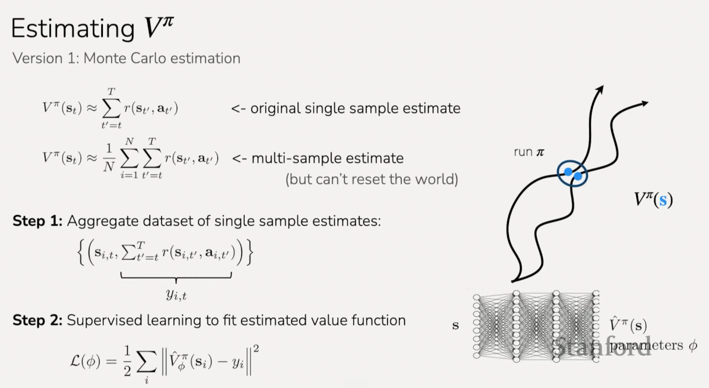

Where you can form an $\mathscr{l}_2$ error between your predicted value and the
observed sum of rewards, and then minimize that with respect to the parameters
of your value function.

So, what this objective looks like:

$$ \min_{\varnothing}\sum_{i, t}{||\hat{V}_{\varnothing}^\pi(s_{i, t}) - y_{i, t}||^2}  $$

Where we minimize with respect to our parameters, $\min_{\varnothing}$, the
difference between your predicted value, $\hat{V}_{\varnothing}^\pi(s_{i, t})$,
and the sum of rewards you saw in the dataset, $y_{i, t}$. And you'll do this
for all the points in your dataset, $\sum_{i, t}$.

So that will be the objective, and you can run gradient descent on this
objective to fit a value function on your data.

So this is the simplest approach for training a value function. It's called
[Monte Carlo estimation](https://en.wikipedia.org/wiki/Monte_Carlo_method) where
essentially you're running lots of simulations/rollouts, and learning how to
predict the outcome of the future rewards.

**Version 2: Bootstrapping**

Now, there's actually an approach that is better than this. In particular, when
we think of these sum of rewards. Let's visualize that we have a bunch of
trajectories that we have sampled. In this case, what we're doing, when we have
a particular state, we are summing the rewards as the value. And, as we're
learning, we're actually starting to learn what the value of a given state is.
This means that, perhaps say halfway through training, when we're regressing to
future rewards, if we start to get what is a good value at another state, then
we can try to use our own estimate of this value as the supervision target.
Particularly if we got a reward at the timestep between these two states.

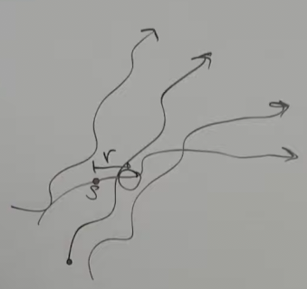

We coulud then use that reward plus our estimate as the supervision target
rather than just using the sum of future reward.

So to compare our two methods:

Monte Carlo target:

$$ y_{i, t} = \sum_{t'=t}^{T}{r(s_{i, t'}, a_{i, t'})} $$

Ideal target:

$$ y_{i, t} = \sum_{t'=t}^{T}{\mathbb{E}_{\pi_\theta}}\left[r(s_{t'}, a_{t'}) | s_{i, t}\right] \approx r(s_{i, t}, a_{i, t}) + \sum_{t'=t+1}^{T}{\mathbb{E}_{\pi_\theta}}\left[r(s_{t'}, a_{t'})| s_{i, t+1}\right] $$

Which essentially means that the ideal target is the true sum of the expecdted
rewards which approximates the reward at the curent timestep plus the expected
sum of rewards at the next timestep. This can further expressed as:

$$ \quad \approx r(s_{i, t}, a_{i, t}) + V^\pi(s_{i, t+1}) $$

Where the sum of rewards at the next timestep is equal to the value of the next
state (the value function above).

Furthermore, we can express this as:

$$ \quad \approx r(s_{i, t}, a_{i, t}) + V^\pi(s_{i, t+1}) \approx r(s_{i, t}, a_{i, t}) + \hat{V}_{\varnothing}^\pi(s_{i, t+1}) $$

In principle, what we could do is instead of trying to regress to future
rewards, we could regress to the reward at the current timestpe plus the value
at the next timestep. In this case, we're actually going to be using an estimate
of the Value at the next time step $\hat{V}$, as part of the supervision target.

So, this would be our new label for our dataset:

$$ \left\{\left(s_{i, t}, \underbrace{r(s_{i, t}, a_{i, t}) + \hat{V}_{\varnothing}^\pi(s_{i, t+1})}_{y_{i, t}}\right)\right\} $$

In practice, the predicted V-function is updated every single gradient. In very
large NN's, some other strategy might be used if this gets too expensive, but in
practice this is done every single gradient.

To recap the steps:

**Step 1:** Aggregate dataset of "bootstrapped" estimates:

$$ \text{training data: } \left\{\left(s_{i, t}, \underbrace{r(s_{i, t}, a_{i, t}) + \hat{V}_{\varnothing}^\pi(s_{i, t+1})}_{y_{i, t}}\right)\right\} $$

**Step 2:** Supervised learning to fit estimated value function

$$ \mathscr{L}(\varnothing) = \frac{1}{2}\sum_{i}{||\hat{V}_{\varnothing}^{\pi}(s_i) - y_i||^2} $$

We're then going to use the same exact objective to fit a value funtion, just
regressing to these targets. We just have different labels in our dataset now.
And these labels are changing as we we are running gradient descent on our
objective. And so, you will often update your labels every gradient update.

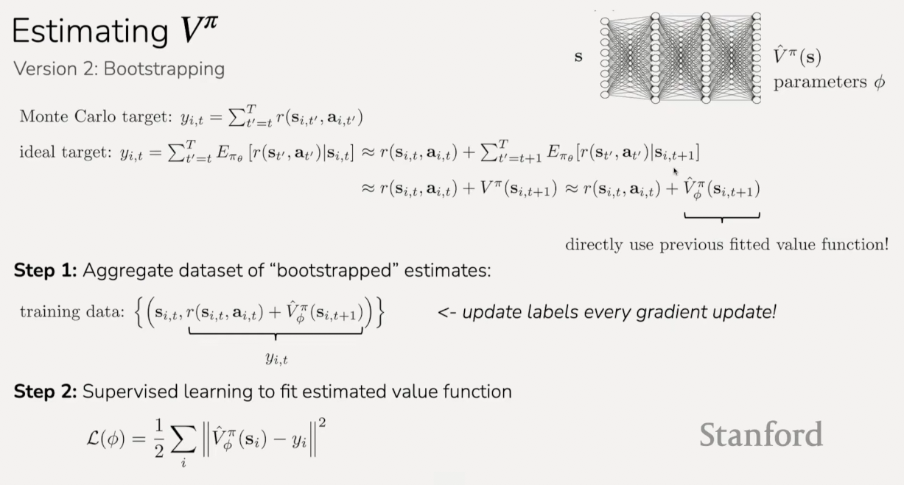

This is also known as
[Temporal Difference learning](https://en.wikipedia.org/wiki/Temporal_difference_learning),
where we're looking at the differnce between the future time step and the
current time step. Generally, this sort of back propagation through time is
fairly distinct from backpropagation.

**Monte Carlo vs. Bootstrap**

To recap, comparing our two formulas we have:

Monte Carlo: _supervise with roll-out's sumed rewards_

$$ y_{i, t} = \sum_{t'=t}^{T}{r(s_{i, t'}, a_{i, t'})} $$

Bootstrapped: _supervise using reward and current value estimate_

$$ y_{i, t} = r(s_{i, t}, a_{i, t}) + \hat{V}_{\varnothing}^\pi(s_{i, t+1}) $$

Consider this simple diagram of two trajectories running policy $\pi$:

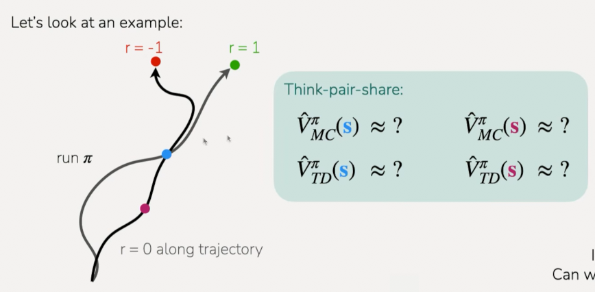

One of these trajectories, the final reward is $-1$, the other the final reward
is $1$. Along this trajectory, before the final state, the reward is zero. The
question posed is, what estimat we would get for two different states for the
value function? In particular if we were training on just these two
trajectories, and we used Monte Carlo vs Temporal Difference:

$$ \hat{V}_{MC}(\textcolor{blue}{s}) \approx \text{?} $$

$$ \hat{V}_{TD}(\textcolor{blue}{s}) \approx \text{?} $$

$$ \hat{V}_{MC}(\textcolor{magenta}{s}) \approx \text{?} $$

$$ \hat{V}_{TD}(\textcolor{magenta}{s}) \approx \text{?} $$

So Monte Carlo in the blue state, it's going to average out the $-1$ and the
$1$, giving us $0$:

$$ \hat{V}_{MC}(\textcolor{blue}{s}) \approx 0 $$

And for the red state, that will be $-1$, because it will supervised to predict
the sum of rewards for the future for this trajectory.

$$ \hat{V}_{MC}(\textcolor{magenta}{s}) \approx -1 $$

The reason for this is the Monte Carlo objective is supervising to the sum of
future rewards that are observed for each trajectory. So for this trajectory,
which is black, it only sees the sum of future rewards along this trajectory, it
only sees $-1$, and anything on the grey trajectory for Monte Carlo would have a
target of $1$, because it only sees the future trajectories and it doesn't
bootstrap off its estimate that was using all of the trajectories .

The Temporal Difference for the blue state will also average out the $-1$ and
the $1$, giving us $0$:

$$ \hat{V}_{TD}(\textcolor{blue}{s}) \approx 0 $$

For the final Temporal Difference for the red state, this will also be a $0$, as
it will see that the future blue state is $0$, and will be assigned $0$ as well:

$$ \hat{V}_{TD}(\textcolor{magenta}{s}) \approx 0 $$

This is an example where Monte Carlo and the Bootstrapped estimate are going to
be different, and arguably we get a more accurate estimate from the Bootstrapped
value, because it's actually able to look at its estimated value and aggregate
the informationa cross trajectories more effectively.

So one question one might ask looking at this is: might there be some sort of
middle ground? Monte Carlo is going to have high variance, but it is completely
unbiased. Whereas the bootstrapped estimate has much lower variance, but it
actually can be incorrect, because your current estimate of the Value function
is inevitably going to have at least a small amount of error in it.

Might there be a way that we can balance this bias and ariance a bit more?

One way we can think about this if we have our trajectgories, we can think of
the Monte Carlo version as using the sum of rewards average over those
trajectories:

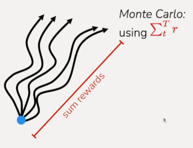

Whereas the TD version is going to be looking at the first reward plus the value
right after that, this sort of $r + V$, a temporal difference for just one
timestep:

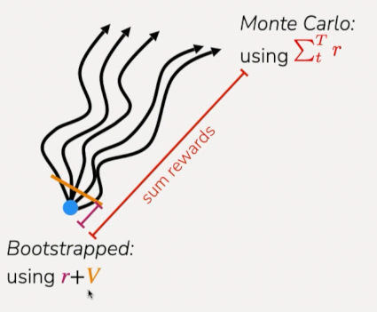

And you can actually interpolate between these two estimates and instead of
using just one timestep, you can use $N$ timesteps. So you could look at the sum
of rewards for $N$ timesteps in the future before the variance has increased
substantially, and then use your value estimate after those $N$ timesteps.

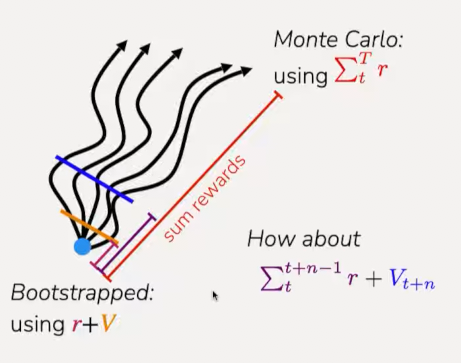

And so what this would look like is an equation like this:

$$ \textcolor{purple}{\sum_{t}^{t+n-1}{r}} + \textcolor{blue}{V_{t+n}} $$

Where instead of using just one reward, and instead of using all of the sums of
rewards, you can sum over the next $N - 1$ rewards, and then just use your Value
estimate at $t + N$.

And so a more detailed version of the above would look like:

$$ \sum_{t'=t}^{t+n-1}{r(s_{t'}, a_{t'}) + \hat{V}^\pi(s_{t+n})} $$

And in this case it's going to have a lot less variance than the full Monte
Carlo, especially if you have smaller $n$. And it's going to be potentially less
biased than just using a one-step temporal difference bootstrap. Essentially
you're going to have more information about the rewards that were directly
observed.

N-step returns:

$$ y_{i, t} = \sum_{t'=t}^{t+n-1}{r(s_{i, t'}, a_{i, t'}) + \hat{V}^\pi(s_{i, t+n})} $$

And the above becomes your target for supervised learning. This is often called
[$N$-step returns](https://gibberblot.github.io/rl-notes/single-agent/n-step.html)
because youre summing over $n$ timesteps. In practice, if you set $n=1$, this is
just the bootstrap version, if you st $n=t$, this is full Monte Carlo.
Oftentimes, somewhere in between $1$ and $t$ works the best in practice. This
can be especially useful in scenarios where you have very small timesteps,
because if your timestep is something like 10 milliseconds, or something like
that, then very little will have happened inbetween those timesteps.

**Aside: discount factors**

$$ y_{i, t} \approx r(s_{i, t}, a_{i, t}) + \hat{V}_{\varnothing}^{\pi}(s_{i, t+1}) $$

$$ \mathscr{L}(\varnothing) = \frac{1}{2}\sum_{i}{||\hat{V}_{\varnothing}^{\pi}(s_i) - y_i||^2} $$

So far we've been summing rewards and we actually talked in the first lecture
about how in some cases we might not want to just blindly sum all rewards in the
future. In particular, if you think about scenarios where the length of the
episode is infinite:

what if $T$ (episode length) is $\infty$?

Then:

$\hat{V}_{\varnothing}^{\pi}$ can get infinitely large in many cases.

So yes, if we think about the length of the episode as being infinite (or very
very long), then your estimate of the Value can get very large in those cases,
and so you might not want to just be summing over all of the rewards in the
future.

A simple trick to handle the fact that your estimates of the value can get very
big is to weight your objective, weight the sum of rewards, to be biased towards
the earlier rewards. The way you can write this is:

simple trick: better to get rewards sooner than later

$$ y_{i, t} \approx r(s_{i, t}, a_{i, t}) + \gamma\hat{V}_{\varnothing}^{\pi}(s_{i, t+1}) $$

Instead of having $r + V$, you can add a coefficient to the Value predictor,
where if the coefficient is $1$ it's the same as before, but you can set it to
something like $0.9$, aor $0.99$. And what this is going to do is you're
essentially saying "I care more abouut the rewards at the current timestep and
less about the rewards at the future timestep."

Adding this discount factor that's discounting future rewards is actually can be
viewed as changing the decision process slightly:

$$ \gamma \in [0, 1] \text{(0.99 works well)} $$

So it's actually equivalent to saying that there is some probability that the
agent will kind of die at any given point in time. So, this is equivalent to
saying, that with some probability, say you have $\gamma = 0.99$, in this case,
using this form is equivalent to saying that there's a 1% chance that the agent
will enter some state that has zero reward and stay there forever.

And so if you have some
MDP([Markov Decision Process](https://en.wikipedia.org/wiki/Markov_decision_process))
right here:

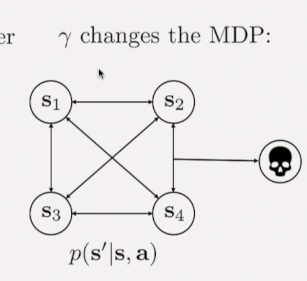

The way this discount factor would change the MDP is it would say that with some
probability, with a probabilty of $1 - \gamma$, you enter this kind of death
state where you can't do anything else after that. The original probabilities in
the rest of the MDP are all multiplied by $\gamma$.

$$ \tilde{p}(s'|s, a) = (1 - \gamma) = \gamma p(s'|s, a) $$

**A Full Algorithm Walkthrough**

1. Sample batch of data of data
   $\{(s_{1, i}, a_{1, i}, \dots, s_{T, i}, a_{T, i})\}$ from $\pi_\theta$

2. Fit $\hat{V}_{\varnothing}^{\pi_\theta}$ to summed rewards in data.

We can do this by looking at the rewards for a short period of time and then the
value.

This is done by the equation for $N$-step returns:

$$ y_{i, t} = \sum_{t'=t}^{t+n-1}{r(s_{i, t'}, a_{i, t'}) + \gamma^{n}\hat{V}_{\varnothing}^{\pi}(s_{i, t+n})} $$

When we fit this, we'll run multiple gradient steps on this objective that's
trying to minimize the difference between our estimates and the observed future
rewards:

$$ \mathscr{L}(\varnothing) = \frac{1}{2}\sum_{i}{||\hat{V}_{\varnothing}^{\pi}(s_i) - y_i||^2} $$

3. Evalute
   $\hat{A}^{\pi_\theta}(s_{t, i}, a_{t, i}) = r(s_{t, i}, a_{t, i}) + \gamma\hat{V}_{\varnothing}^{\pi_\theta}(s_{t + 1}, i) - \hat{V}_{\varnothing}^{\pi_\theta}(s_{t, i}) \forall t,i$

Then once we have the estimate of the value, we can use that to estimate the
advantage of a particular action. We do this by looking at the reward plus the
value at the next timestep minus the value at the current timestep. This is
telling us how, according to our value function and the reward we saw, how good
is the action that was taken in the dataset.

4. Evaluate
   $\nabla_\theta J(\theta) \approx \sum_{t,i}{\gamma_\theta\log\pi_\theta(a_{t, i}, s_{t, i})\hat{A}^{\pi_\theta}(s_{t, i}, a_{t, i})}$

And then we can use this to get a gradient for our policy where we will be
increasing the likelihood of actions that are estimated to be advantageous and
decreasing the likelihood for actions that are not advantageous.

5. Update $\theta \leftarrow \theta + \alpha\nabla_\theta J(\theta)$

And then lastly, we'll update our policy by applying this gradient step to our
policy parameters. We can then repeat this process to sample a new batch of data
for our policy.

Consider the following image:

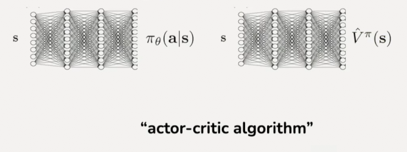

Note here that we have two NNs, one is for the policy and one is for the value
function. This is called an
[Actor-critic Algorithm](https://en.wikipedia.org/wiki/Actor-critic_algorithm)
because one of the networks is the actor, one of the networks is the value
function which can also be called a critic, because it is criticizing how good a
state and policy is.

And that's our algorithm. Coming back to our examples from before, this is
something that's able to actually make use of data for examples that takes a
step forward and then falls backwards because you can actually learn from the
data especially when you use bootstrapped estimates that taking a step forward
is advantageous and has a positive advantage compared to other actions that you
might take. This is going to be making much more efficient use of the data that
we've collected.

## Review so far

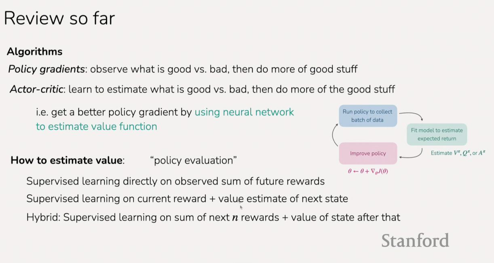
