# Lecture 5: Off-Policy Actor Critic

## Recap: Policy Gradients

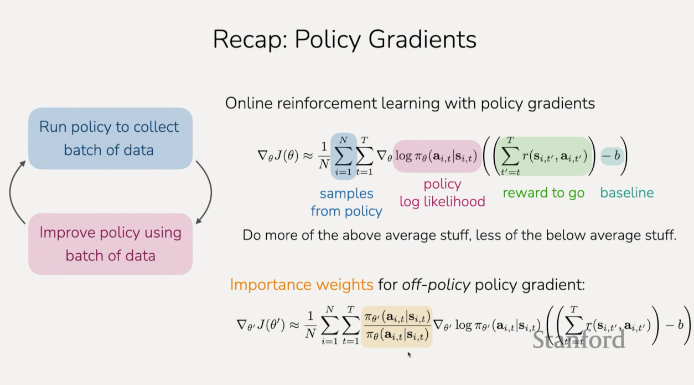

## Recap: Some Useful Objects

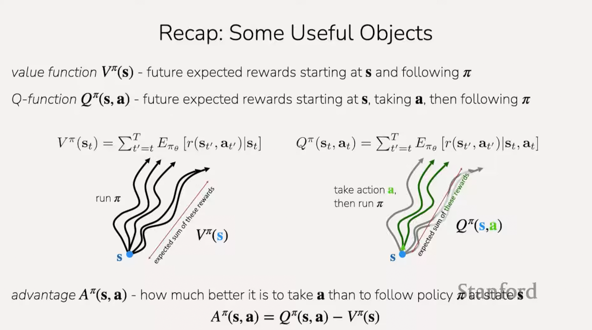

## Recap: Actor-Critic Methods

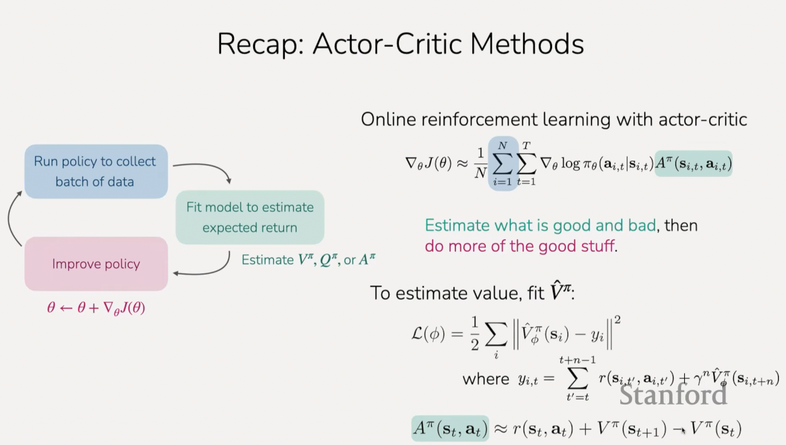

## The plan for today

**Off-policy actor critic methods**

1. Taking multiple gradient steps

   a. Importance weights

   b. Constraining step size with KL penalty or clipping

   C. Practical PPO algorithm

2. Even more off-policy algorithm

   d. Fitting Q-value functions with data from other policies

   e. Practical SAC algorithm

3. Comparisons between PPO, SAC, imitation learning

**Key learning goals:**

- All of the key concepts for practical algorithms like PPO and SAC

## Off-Policy Actor-Critic Methods

So these are the steps we go through for an On-Policy Actor-Critic Method:

**Version 1**: Multiple Gradient Steps

1. Sample batch of data $\{(s_{1, i}, a_{1, i}, \dots, s_{T, i}, a_{T, i})\}$
   from $\pi_\theta$

2. Fit $\hat{V}_{\varnothing}^{\pi_\theta}$ to summed rewards in data

3. Evaluate
   $\hat{A}^{\pi_\theta}(s_{t,i}, a_{t,i}) = r(s_{t,i},a_{t,i}) + \gamma\hat{V}_{\varnothing}^{\pi_\theta}(s_{t+1, i}) - \hat{V}_{\varnothing}^{\pi_\theta}(s_{t,i}) \forall t,i$

4. Evaluate
   $\nabla_\theta J(\theta) \approx \sum_{t,i}{\gamma_\theta\log\pi_\theta(a_{t,i}|s_{t,i})\hat{A}^{\pi_\theta}(s_{t,i},a_{t,i})}$

5. Update $\theta \leftarrow \theta + \alpha\nabla_\theta J(\theta)$

Now, if we want to be able to take multiple gradient steps, we need to be able
to evaluate our gradient, not just at our current policy that collected the
data, but after we've taken a gradient step, for example, after we take step 5,
we're now going to have a new step of parameters that were different from what
was the collected data in step one.

So what we're going to do is we're going to use importance weights (at step 4),
which we saw in the policy gradient lecture. Our new gradient is going to look a
little different. Say we've collected data with $\pi_\theta$. Now we've taken a
gradient step and we have $\pi_{\theta'}$. So we now want to be able to evaluate
the gradient of the objective at $\theta'$:

$$ \nabla_{\theta'}J(\theta') $$

To do this, we will reuse the data that we collected from $\pi_\theta$ in step
1:

$$ \nabla_{\theta'}J(\theta') \approx \sum_{t, i} $$

And we're then going to use the same gradient step as before, but we're going to
weight the gradient term with an importance ratio that is a ratio between our
new policy $\pi_{\theta'}$, and the policy to collect the data, which is
$\pi_\theta$:

$$ \nabla_{\theta'}J(\theta') \approx \sum_{t, i}{\frac{\pi_{\theta'}(a_i|s_i)}{\pi_\theta(a_i, s_i)}} $$

And the rest will look the same as before:

$$ \nabla_{\theta'}J(\theta') \approx \sum_{t, i}{\frac{\pi_{\theta'}(a_i|s_i)}{\pi_\theta(a_i, s_i)}\nabla_{\theta'}\log\pi_{\theta'}(a_i|s_i)\hat{A}^{\pi_{\theta}}(s, a)} $$

Where we'll be evaluating the gradient of $\log\pi_{\theta'}$ times the
advantage estimate, $\hat{A}^{\pi_\theta}$. This advantage estimate will still
be for our policy before taking the gradient step, $\pi_\theta$. And this will
be for a given $s$ and $a$ pair.

So that is our new gradient.

In principle, once we've done this, this means that we can take multiple
gradient steps. So we can sample a batch of data once, and then fit our
advantage estimates, and then compute our gradient, take a gradient step, and
then recompute our gradient step and so forth. The ony thing that's going to
change as we take more gradient steps is this importance weight,
$\dfrac{\pi_{\theta'}(a_i|s_i)}{\pi_{\theta}(a_i|s_i)}$. And we'll be doing back
propagation on our new parameters rather than our old parameters,
$\nabla_{\theta'}\log\pi_{\theta'}(a_i|s_i)$. And our advantage estimates will
still be based off of the old policy, $\hat{A}^{\pi_\theta}(s, a)$.

**What can go wrong?**

Now, there's something that can go wrong here. To see what can go wrong, it's
helpful to look at the surrogate objective. Right now, we're looking at the
gradient that we're going to be applying. But when we actually implement this in
practice, we'll be having some surrogate objective that we construct in order to
use auto differentiation to get the gradients fro free from PyTorch. And so, if
we were to write down the surrogate objective for this, we need to formulate
some objectives such that the gradient of our surrogate objective is equal to
our summation we wrote out above.

$$ \tilde{J}(\theta') $$

To do that, we have to remember that we have this conveninent identity:

$$ p_\theta(\tau)\nabla_\theta\log p_\theta(\tau) = \nabla_\theta p_\theta(\tau) $$

where a probability times the grad log of a probability is equal to the gradient
of the original probability. This is the sort of same kind of log trick that
we've been seeing, that we used to formulate the original policy gradient
objective.

The way this comes in handy is that we actually see this in our summation above
with the $\nabla_{\theta'}\log\pi_{\theta'}$:

$$ \nabla_{\theta'}J(\theta') \approx \sum_{t, i}{\frac{\pi_{\theta'}(a_i|s_i)}{\pi_\theta(a_i, s_i)}\underbrace{\nabla_{\theta'}\log\pi_{\theta'}}(a_i|s_i)\hat{A}^{\pi_{\theta}}(s, a)} $$

And so that means that this is equal to the gradient of $\pi_{\theta'}$,
$\nabla_{\theta'}\pi_{\theta'}$.

And if we then want to construct a surrogate objectgive such that it's gradient
is this, then, the surrogate objective:

$$ \tilde{J}(\theta') \approx \sum_{t,i} $$

Can be replaced with:

$$ \tilde{J}(\theta') \approx \sum_{t,i}\frac{\pi_{\theta'}(a_{t,i}|s_{t,i})}{\pi_{\theta}(a_{t,i}|s_{t,i})} $$

And thee advantage right here:

$$ \tilde{J}(\theta') \approx \sum_{t,i}\frac{\pi_{\theta'}(a_{t,i}|s_{t,i})}{\pi_{\theta}(a_{t,i}|s_{t,i})}\hat{A}^{\pi_\theta}(s_{t, i}, a_{t, i}) $$

Now, if look at the surrogate objective $\tilde{J}(\theta')$. The policy is
going to be trying to maximize this, when we take gradient steps on our policy.
The thing the policy will want to do, is it will take the advantage estimates,
$\hat{A}$, that are positive and increase the probability of our actions for
those, $\pi_{\theta'}$, especially if there were actions that had very low
probability, $\pi_\theta$, that we'd want to increase this alot, so we can get a
very high ratio at the importance weight ratio, such that we increase the
likelihood of actions for high advantages, and then for negative advantages,
we'll want to decrease the probability.

Now this all seems reasonable here, the thing that's a little bit tricky is that
these advantages are still based off of the old policy, $\pi_\theta$, and they
were estimated based on a single batch of data. So, if you take too many
gradient steps on the surrogate objective, it means that you might, in some
ways, overfit. You might be using these advantages at some point when they might
become out of date and may no longer be applicable to your new policy.

The challenge that come up is that you might get really unstable learning.

As a rough visual for what this might look like. Let's say on the $x$-axis
represents the number of state actions that you've collected, and then on the
$y$-axis, you have the rewards that your policy is seeing over the course of
learning (as it collects more data). If you only take one gradient step for
every batch of data that you collect, then your learning will be something like
this:

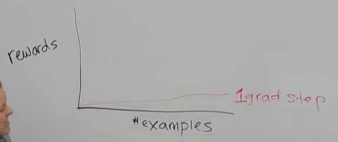

Where it learns very slowly because you can only take one gradient step for each
batch of data, and that means that it's going take many many data points in
order to learn.

Now, say you maybe increase this a little bit, say 5 gradient steps. You should
learn a little bit faster, so maybe your graph now looks like this:

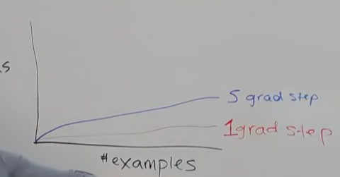

Because you're taking more gradient steps, with respect to the amount of data
that you're collecting, your reward should increase more.

But then if you try to get a bit greedy and do a lot more gradient steps on this
objective, you might start to overfit your advantages, and you might get
something where you'll start to increase more very quickly, and at some point
the learning might be unstable and at some point it might even collapse.

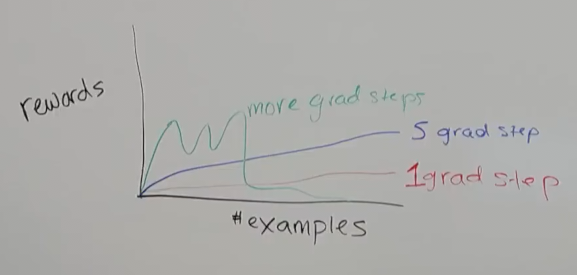

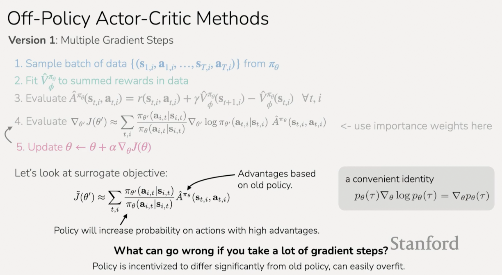

So, how do we address this issue of potentially overfitting as the amount of
gradient steps increases? How can we actually be able to take more gradient
steps without incurring this instability? The key idea is that if we keep the
new policy a little bit more close to the original policy, then those advantage
estimates are more likely to be valid.

There's two ways we might be able to encourage the new policy to be similar to
the old one. One would be to add a term to our surrogate objective, that
explicitly is going to try to encourage the policies to be similar. These
policies are representing distributions over actions, so one way we could do
that is to add a term to our objective.

$$ \tilde{J}_{\text{con}}(\theta') $$

Where we are using $\text{con}$ to denote that our surrogate objective is
constrained. This is going to be approximately equal to the original surrogate
objective that we're trying to maximize:

$$ \tilde{J}_{\text{con}}(\theta') \approx \tilde{J}(\theta') $$

And then what we can do is incur a penalty that discourages you from changing
too much from the previous policy. And this penality could take the form of the
[KL divergence](https://en.wikipedia.org/wiki/Kullback%E2%80%93Leibler_divergence)
between two distributions.

$$ \tilde{J}_{\text{con}}(\theta') \approx \tilde{J}(\theta') - D_{KL}(\pi_{\theta'}(\cdot|s) || \pi_\theta(\cdot|s)) $$

So if we add this to our surrogate objective, what this will do is it will
encourage the policies to stay close to one another while you take more gradient
steps. So your advantage function will be more accurate. This will allow you to
more stably take more gradient steps. Now, it will still be constraining your
step size, so there is a bit of a balancing act going on here. But essentially,
the results of something like this in principle should (hopefully) look more
consistent with what we might expect.

---

So a student asks the question on how do we encourage it to change a little bit,
but not too much? Oftentimes, you'll have some hyperparameter that is in front
of the KL divergence that needs to be tuned:

$$ \tilde{J}_{\text{con}}(\theta') \approx \tilde{J}(\theta') - \beta D_{KL}(\pi_{\theta'}(\cdot|s) || \pi_\theta(\cdot|s)) $$

Where $\beta$ controls how much you're allowing it to shift. This ends up being
oftentimes, a fairly important hyperparameter when you use KL constraints. At
the same time, you can tune it within an order of magnitude rather than very
carefully finding some specific floating point number.

---

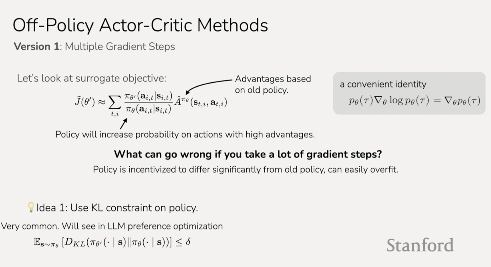

So, the first idea is to use a KL constraint. It is very common to do. We will
leave it at this for now. We actually won't use KL constraints. There actually
is a version of PPO that uses KL constraints, but it's not the most common
version. It's also used alot in preferance optimization. So we'll probably see
it again in a couple of weeks.

For now, let us explore a second idea:

So we could actually add this constraint in the objective. The other thing that
we could do is we could, for this importance weight ratio,
$\dfrac{\pi_{\theta'}(a_i|s_i)}{\pi_{\theta}(a_i|s_i)}$, we could simply remove
the incentive for the policy to change this ratio alot. The way we would do that
is we could actually just clip this ratio, so that this ratio never exceeds nor
goes below certain values. What that would look like is:

**Version 2:**

$$ \text{clip}\left(\frac{\pi_{\theta'}(a_i|s_i)}{\pi_{\theta}(a_i|s_i)}, 1 - \epsilon, 1 + \epsilon\right) $$

Where we clip our importance weight ratio between Some lower value
$1 - \epsilon$, and some higher value $1 + \epsilon$. Where $\epsilon$ could be
something like $0.2$. Which essentially is like saying that if it goes below
$0.8$, then it will just be $0.8$, and if this goes above $1.2$, then we'll just
leave it as $1.2$.

Now, this clipping, this is a bit informal. If we were to write this out
mathematically, we would assign our importance ratio to a variable, say $w$.
Then if we wanted to clip it below this $1 - \epsilon$, then we would be taking:

$$ \min(\max(w, 1 - \epsilon), 1 + \epsilon) $$

And now, if we use this clipped importance weights in our objective, then once
the policy changes the ratio to be above $1.2$, it's no longer going to be able
to increase the probability any further. It isn't going to help it, it will no
longer be incentivized to increase the probability further because the objective
will just stay as $1.2$ times the advantage. Note that it's not _explicitly_
telling the policy not to change, but it's removing the incentive to change
significantly from the old policy.

In practice, $\epsilon \approx 0.2$.

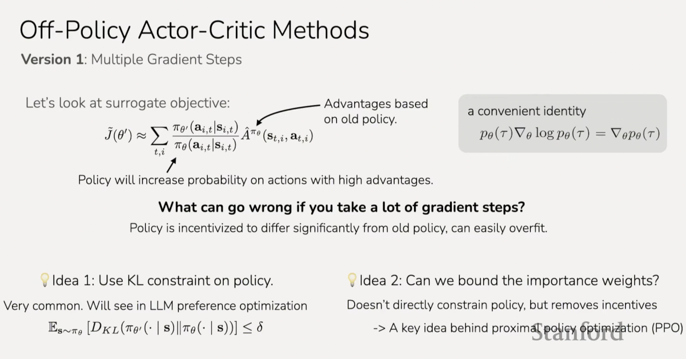

This sort of idea behind bounding the importance weight is one of the key ideas
behind PPO, which is a popular RL algorithm.

## Proximal Policy Optimization (PPO)

**Off-policy actor-critic with a few tricks**

Surrogate objective:

$$ \tilde{J}(\theta') \approx \sum_{t,i}{\frac{\pi_{\theta'}(a_{i,t}|s_{i,t})}{\pi_{\theta}(a_{i,t}|s_{i,t})}}\hat{A}^{\pi_\theta}(s_{t,i},a_{t,i}) $$

If we were then to put this clipping into practice, we could take our surrogate
objective and then replace the importance weights by the clipped importance
weights:

**Trick #1:** Clip the importance weights:

$$ \tilde{J}(\theta') \approx \sum_{t,i}\text{clip}\left(\frac{\pi_{\theta'}(a_{i, t}|s{i, t})}{\pi_{\theta}(a_{i, t}|s{i, t})}, 1 - \epsilon, 1 + \epsilon\right)\hat{A}^{\pi_\theta}(s_{t,i},a_{t,i}) $$

Now, there's a couple more tricks that PPO introduces to try to get stable RL
improvement. In this first trick, the policy is no longer incentivized to
deviate significantly.

One thing that's a little bit funky about these importance weights is that there
is actually a possibility that the clipping, in some cases, might actually make
the objective better. If, for example, the policy ended up assigning a very low
probability to a negative advantage, and it went below the advantages, then
you're clipping it to a higher weight. So one thing that PPO does, and the final
objectgive of PPO is to take this clipped objective, but take the minimum with
respect to the original object. This minimum is just making sure that the
clipping will never make the objectgive better, and it formulates a lower bound.
It ensures that this is a lower bound on the original surrogate objective.

**Trick #2:** Take _minimum_ w.r.t. original objective: (in rare event where
clipping makes objective better)

$$ \tilde{J}(\theta') \approx \sum_{t,i}\min\left(\frac{\pi_{\theta'}(a_{i, t}|s{i, t})}{\pi_{\theta}(a_{i, t}|s{i, t})}\hat{A}^{\pi_\theta}(s_{t,i},a_{t,i}),\text{clip}\left(\frac{\pi_{\theta'}(a_{i, t}|s{i, t})}{\pi_{\theta}(a_{i, t}|s{i, t})}, 1 - \epsilon, 1 + \epsilon\right)\hat{A}^{\pi_\theta}(s_{t,i},a_{t,i})\right) $$

And this means that we're going to be maximizing a lower bound on our
objectgive, and usually if you're ever going to be maximizing something that's
different from your original objectgive, it's good if it's a lower bound,
because you're not going to be maximizing something beyond the original
objective.

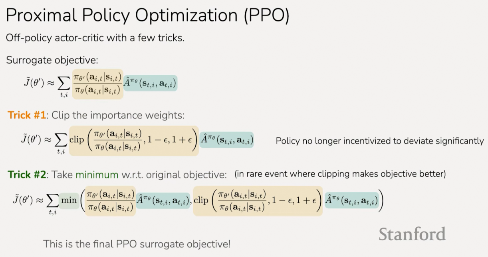

This is the final PPO surrogate objective. The last trick addresses:

How do we estimate the advantage?

**Trick #3:** "Generalized advantage estimation" (GAE)

The way this works is that you are still fitting a value function in a normal
way:

Fit $V^\pi$ with Monte Carlo or bootstrapping.

Then, use varying horizon to estimate advantage:

$$ \hat{A}_n^\pi(s_t, a_t) = \sum_{t'=t}^{t+n}{\gamma^{t' - t}r(s_{t'}, a_{t'}) - \hat{V}_{\varnothing}^{\pi}(s_t) + \gamma^n\hat{V}_{\varnothing}^{\pi}(s_{t + n})} $$

$$ \hat{A}_{GAE}^{\pi}(s_t, a_t) = \sum_{n=1}^{\infty}{w_n\hat{A}_n^\pi(s_t, a_t)} $$

This is different then the standard estimation of the advantage. Here we are
actually going to be summing over multiple of the rewards into the future and
adding that future value instead of just adding one step into the future.

You can think of this as if you calculate these different advantages with
varying horizons, and then weight them accordingly, then you can get advantage
estimates that have varying variance and maybe have less bias than if you just
use the one step estimate.

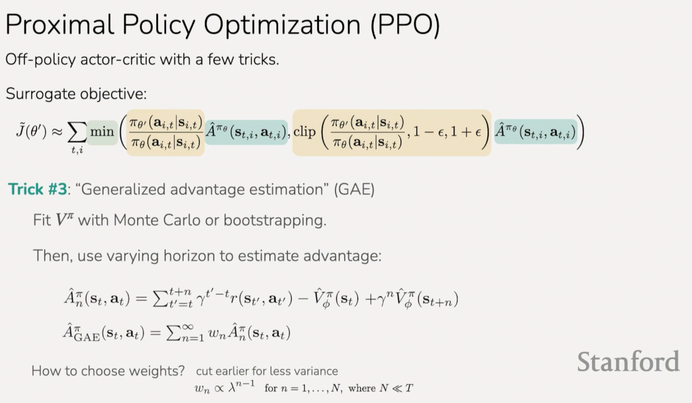

So our final algorithm looks like:

1. Sample batch of data $\{(s_{1,i}, a_{1,i},\dots,s_{T,i},a_{T,i})\}$ from,
   $\pi_\theta$

2. Fit $\hat{V}_{\varnothing}^{\pi_\theta}$ to summed rewards in data

3. Evaluate
   $\hat{A}_{GAE}^{\pi}(s_t,a_t) = \sum_{n=1}^{\infty}{w_n\left(\sum_{t'=t}^{t+n}{\gamma^{t'-t}(s_{t',a_{t'}}) - \hat{V}_{\varnothing}^\pi(s_t) + \gamma^{n}\hat{V}_{\varnothing}^{\pi}(s_{t+n})}\right)}$

4. Update policy with $M$ gradient steps on surrogate objective:

$$ \tilde{J}(\theta') \approx \sum_{t,i}{\min\left(\frac{\pi_{\theta'}(a_{i,t}|s_{i,t})}{\pi_{\theta}(a_{i,t}|s_{i,t})}\hat{A}^{\pi_\theta}(s_{t,i},a_{t,i}), \text{clip}\left(\frac{\pi_{\theta'}(a_{i,t}|s_{i,t})}{\pi_{\theta}(a_{i,t}|s_{i,t})}, 1 - \epsilon, 1 + \epsilon\right)\hat{A}^{\pi_\theta}(s_{t,i},a_{t,i})\right)} $$

5. Repeat

Some example hyperparameters (these are scenario dependent):

- ~2000 timestamps in batch of data

- ~10 epochs when updating policy ($M =$~300 gradient steps with batch size 64)

- clipping range $\epsilon$ = 0.2

- ~500 iterations $\rightarrow$ 1M total timesteps of experience

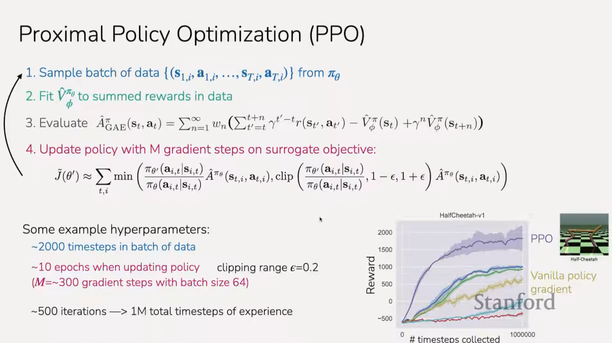

## Off-Policy Actor-Critic Methods

**So far:**

- use one batch of policy data for one gradient step (full on-policy)

- use one batch of policy data for multiple gradient steps (starting to be
  off-policy)

**Can we be even more off-policy?**

Can we reuse data from previous batches, _i.e._ all of the past trial-and-error
data?

**Two key ideas:**

- maintain a buffer of all past data "replay buffer"

- adjust equations to remove on-policy assumptions

**Version 2:** Replay buffers

actor-critic algorithm:

1. collect experience $\{s_i, a_i\}$ from $\pi_\theta(a|s)$

2. fit $\hat{V}_{\varnothing}^{\pi}(s)$ to sampled reward sums

3. evaluate
   $\hat{A}^\pi(s_i, a_i) = r(s_i, a_i) + \gamma\hat{V}_{\varnothing}^{\pi}(s_{i}') - \hat{V}_{\varnothing}^{\pi}(s_i)$

4. $\nabla_\theta J(\theta) \approx \sum_{i}{\nabla_\theta\log\pi_\theta(a_i|s_i)\hat{A}^\pi(s_i,a_i)}$

5. $\theta \leftarrow \theta + \alpha\nabla_\theta J(\theta)$

6. Repeat

In essenece you can think of it getting one policy, updating our policy, then
getting another batch, and updating our policy, and so on. And when we update
our policy, this will actually be coming from a _replay buffer_, we'll be
actually doing gradient steps using all of our past experiences rather than just
our immediate past experiences.

In particular, when we collect experiences (step 1), we'll be wanting to add
this to our replay buffer, and when we then update our policy, we want to use a
minibatch sampled from all previous data rather than just our last batch of
data.

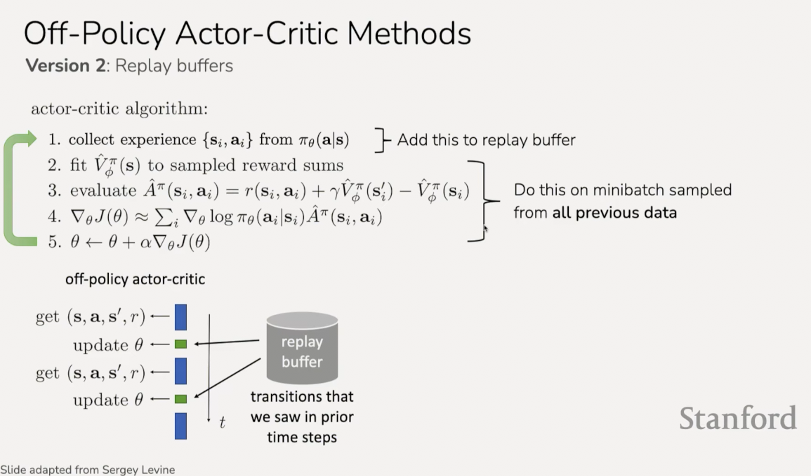

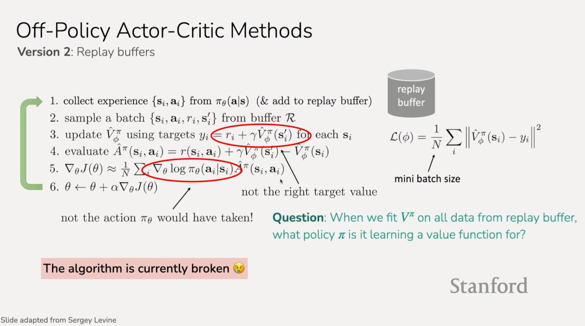

As the above slides show, the replay buffer algorithm we haev written out is
broken. It is broken in two different ways. Say that we are using bootstrapping
to update our value function, then our target would be our reward at the current
timestep plus our value estimate for the next state.

$$ r_i + \gamma\hat{V}_{\varnothing}^\pi(s_{i}') $$

So, when we fit $V\pi$ on all the data from the replay buffer, what policy $\pi$
is it learning a value function for?

So, firstly, the answer to this question is not as clean as some of the previous
questions we've posed thus far. Our latest policy might have one data point for
that policy, but most of the buffer is not from that policy. So we don't have
much data at all from our current policy, so it's not our current policy and
that's why this is incorrect. In particular, when we collect trajectories from
previous policies, the actions will be different and that manes that the next
state will be different when you took that action as well as the reward.

So the policy that you'll be learning a value function is some sort of mixture
of all of your past policies. It's actually not trivial to write down. If things
were collected in a particular way, the policy might look something like an
average over your previous policies:

$$ \pi = \frac{1}{N}\sum_{i}{\pi_i} $$

Now, it's actually a little different than this, because in some states, one
policy might have veered off in one direction, while another policy might have
veered off in a dramatically different direction. So thusly the policies would
reflect this vast difference. The thing that is definitive is that it's not
going to be a value function for your current policy.

We would like to get a value function for our current policy using data from
previous policies, so we can then estimate this advantage for our current policy
and get a gradient for our current policy (at step 5).

The other thing that is wrong with this occurs here, on step 5:

$$ \nabla_\theta\log\pi_\theta(a_i, s_i) $$

This is not the action $\pi_\theta$ would have taken. Likewise, when you pass
the action $a_i$ into the advantage $\hat{A}$, that's not the action the policy
would have taken. So, we'll also see how we can fix that part.

First let's talk about the value function:

## Off-Policy Actor-Critic Methods

How do we fit a value function for $\pi_\theta$ using replay buffer of data from
past policies?

- What if we fit $Q(s,a)$ instead of $V(s)$?

We can remember that the Q-function is very similar to the Value function. It's
the sum of rewards if we start at $s$ and take action $a$. So you can think of
it as:

$$ Q^{\pi_\theta}(s_t,a_t) = \sum_{t'=t}^{T}{\mathbb{E}_{\pi_\theta}\left[r(s_{t'},a_{t'})| s_t, a_t\right]} $$

So this is just the definition of the Q-function. Now we have the summation of
our future timesteps. We can write out this summation. In particular if we write
out the first timestep, the first is just:

$$ \quad= r(s_t, a_t) + \sum_{t'=t+1}^{T}{\mathbb{E}_{s_{t+1}\sim p(\cdot|s_t,a_t), \pi_\theta}\left[r(s_{t'}, a_{t'})\right]} $$

The first state and action is just $s_t, a_t$, because that's what we're passing
into the Q-function. We know the reward of the first state and action that we
took, and then we add the summation over starting at $t + 1$, over the sum of
future rewards. This sum of future rewards would have to be an expectation after
the initial $s_t,a_t$, so this expectation would start from $s_{t+1}$ under the
dynamics: $s_{t+1}\sim p(\cdot|s_t,a_t)$. And the remaining actions, an end
states sampled from $\pi_\theta$.

Now, this is starting to look once again like a Value function, and we can write
this in terms of $Q$. And this equivalent to:

$$ \quad = r(s_t, a_t) + \mathbb{E}_{s_{t+1} \sim p,a_{t+1} \sim \pi}\left[Q(s_{t+1},a_{t+1})\right] $$

The reward at the current timestep plus the expectation over $s_{t+1}$ and
$a_{t+1}$ sampled from our policy $\pi$, then the current timestep is the reward
plus this expectation of the next $Q$, the future $Q$.

So we can essentially define $Q$ this way.

And what's nice about this is that this holds for any state and action. We
haven't made any assumption about which state and action this data was collected
for.

This evaluates to a final form of:

For any $(s,a)$:

$$ Q^{\pi_\theta}(s, a) = r(s,a) + \gamma\mathbb{E}_{s'\sim p(\cdot|s,a),\overline{a}\sim\pi_\theta(\cdot|s')}\left[Q^{\pi_\theta}(s', \overline{a}')\right] $$

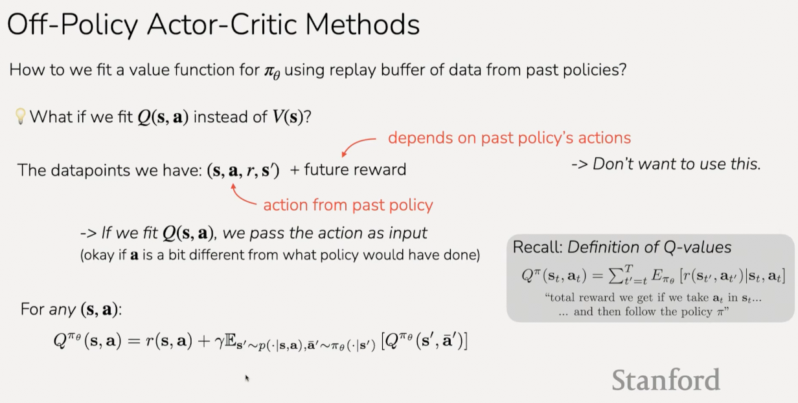

So our approach will be as follows:

**Approach:**

1. Sample $(s_i, a_i, s_{i}')$ from teh buffer

2. sample $\overline{a}_{i}' \sim \pi_\theta(\cdot|s_{i}')$ from _current_
   policy

$$ Q^{\pi_\theta}(s_i, a_i) \approx \underbrace{r(s_i, a_i) + \gamma Q^{\pi_\theta}(s_{i}', \overline{a}_{i}')}_{y_i} $$

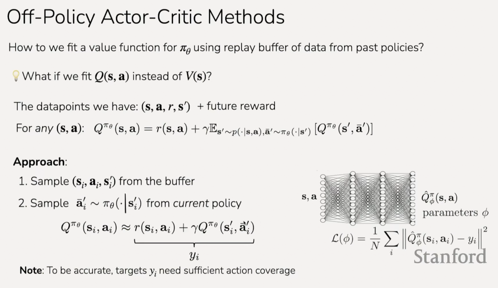

3.update $\hat{Q}_{\varnothing}^{\pi}$ using targets
$y_i = r_i + \gamma\hat{Q}_{\varnothing}^{\pi}(s_{i}', a_{i}')$

Note that the $a_{i}'$ in the next $Q$ prediction is **not** from the replay
buffer $\mathscr{R}$. Instead it will be sampled from ourpolicy conditioned on
the next state from the buffer.

$$ a_{i}' \sim \pi_\theta(a_{i}'|s_{i}') $$

And that will be our revised step 3 for the algorithm:

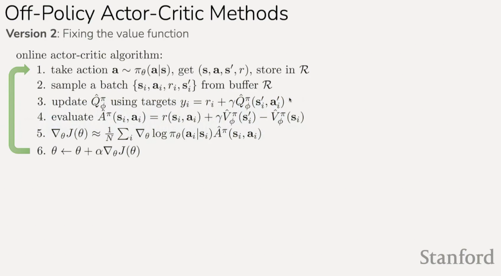

And now we still need to fix the second issue, which was in step 5:

5. $\nabla_\theta J(\theta) \approx \dfrac{1}{N}\sum_{i}{\nabla_\theta\log\pi_\theta(a_i|s_i)\hat{A}^\pi(s_i,a_i)}$

Specifically this part:

$$ \nabla_\theta\log\pi_\theta(a_i|s_i)\hat{A} ^\pi(s_i,a_i)$$

There's a couple things we'll do here:

**First:** convenient to use $\hat{A}^\pi$ instead of $\hat{A}^\pi$. (_i.e._ no
average reward baseline). Higher variance, but okay b/c we're now using a lot
more data (all data in buffer).

**Second:** current policy's actions likely better than past policy's actions.
sample:

$$ a_{i}^\pi \sim \pi_\theta(a|s_i) $$

$$ \nabla_\theta J(\theta) \approx \frac{1}{N}\sum_{i}{\nabla_\theta\log\pi_\theta(a_{i}^\pi|s_i)\hat{Q}^\pi(s_i,a_{i}^\pi)} $$

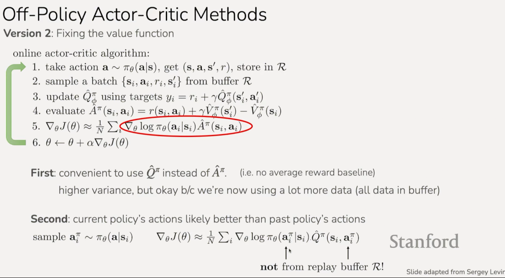

**Any remaining problems?**

$s_i$ didn't come from $p_\theta(s)$

nothing we can do here, just accept it

**intuition:** we want optimal policy on $p_\theta(s)$, but we get optimal
policy on a _broader_ distribution.

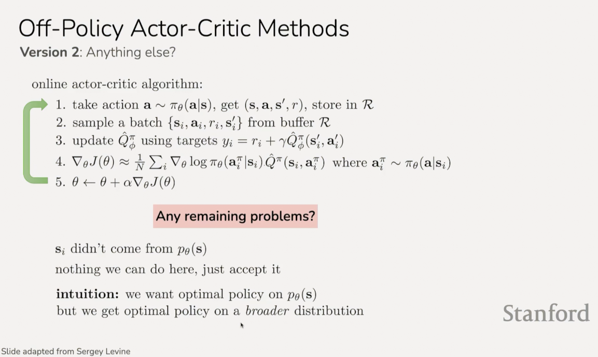

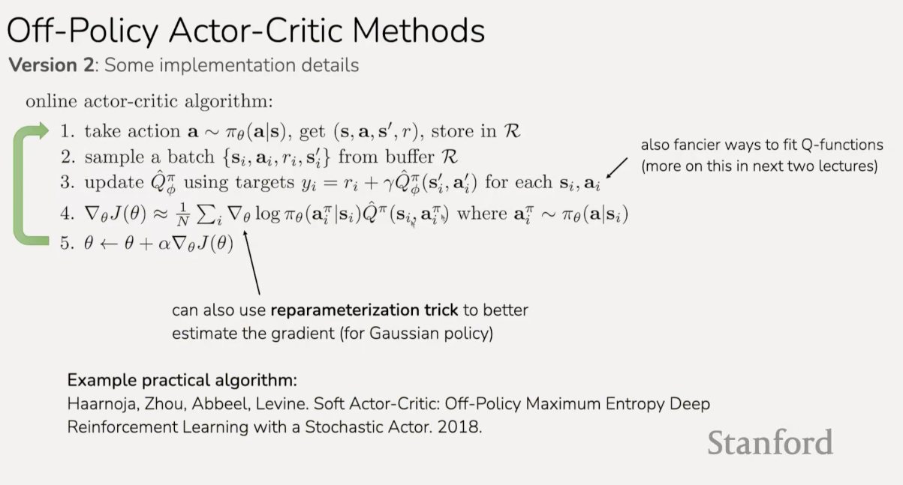

This is our final algorithm here, it is not without it's issues, which we'll go
into in future lectures. It is known as
[Soft Actor-Critic](https://www.geeksforgeeks.org/deep-learning/soft-actor-critic-reinforcement-learning-algorithm/)
algorithm.

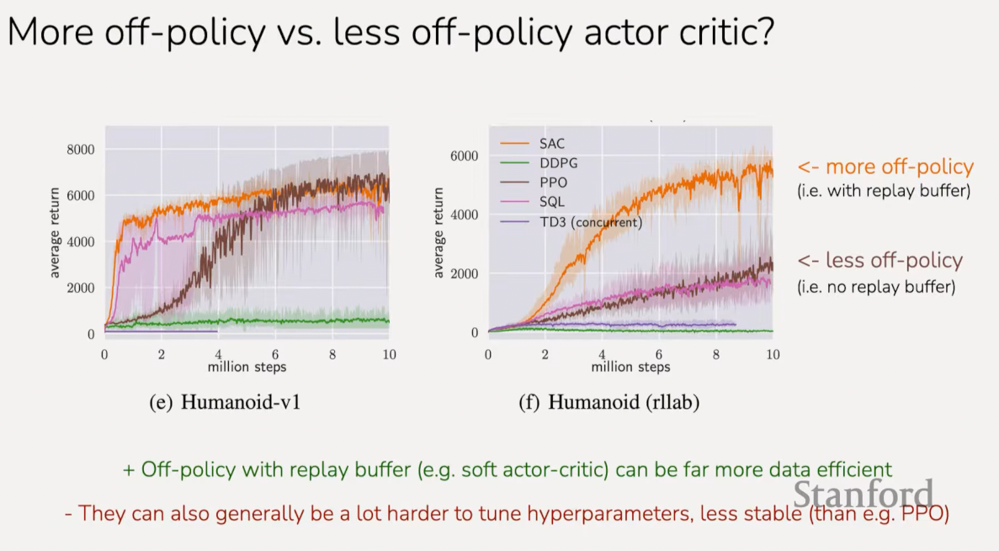
