# Lecture 6: Q-Learning

## Recap: Some Useful Objects

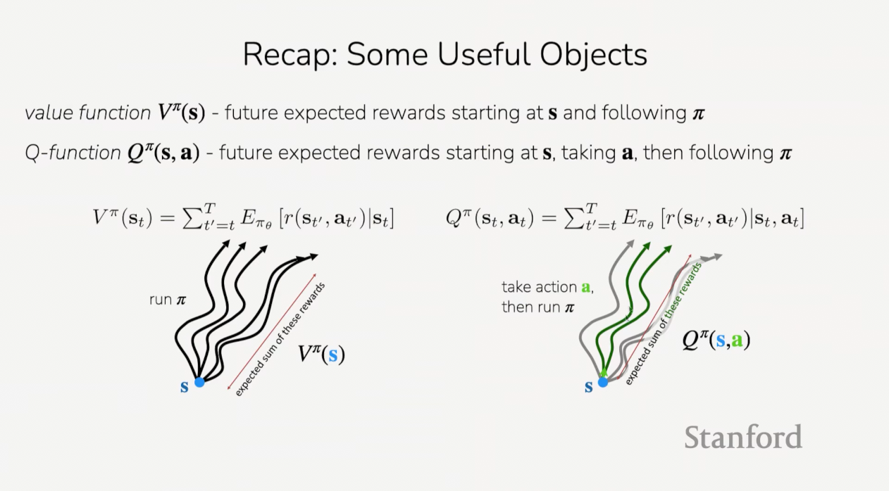

## Recap: Methods

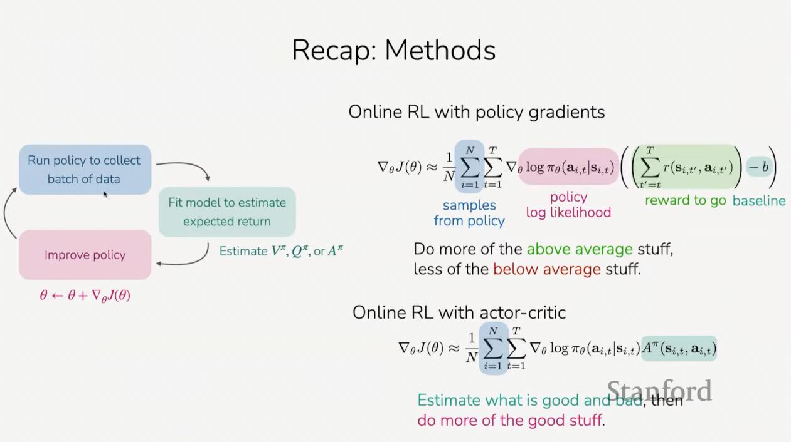

## Recap: Off-Policy Policy Evaluation

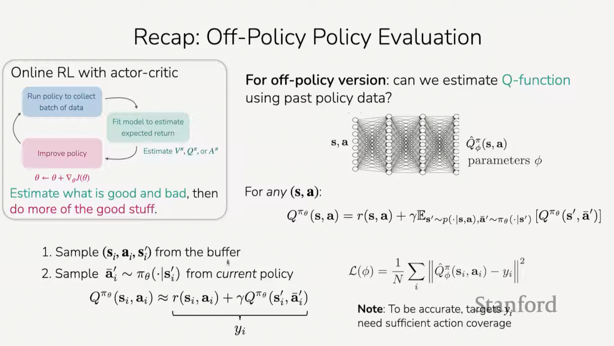

## The plan for today

**Value-based RL methods**

1. Q-learning method

   a. Policy iteration

   b. Bellman optimality equation

   c. How to collect data for Q-learning methods

2. Q-learning in practice

   d. Target networks

   e. Double DQN

   f. N-step returns

**Key learning goals:**

- How Q-functions relate to policies

- How to do RL without learning an explicit policy

- How to stabilize Q-learning in practice

## A thought exercise

Say you have some policy and for your policy you have a pretty good estimate of
the Q-function.

For some policy $\pi$, say you have an accurate estimate $\hat{Q}^\pi(s, a)$ for
all $s, a$.

**Recall: Definition of Q-values**

$$ Q^\pi(s_t,a_t) = \sum_{t'=t}^{T}{\mathbb{E}_\pi\left[r(s_{t'},a_{t'})|s_t,a_t\right]} $$

"total reward we get if we take $a_t$ in $s_t$... and then follow the policy
$\pi$"

And an object that we're going to be thining about a lot today is if you have
some estimate of the Q-function for, in this case a policy, then, one thing you
could do is, instead of following soome policy that you've already learned, you
could potentially formulate a policy by choosing the action that maximizes your
estimate. So instead you could pick your action as your highest p-value.

$$ \max_a\hat{Q}^\pi(s, a)  $$

To continue on this, we'll define a policy that does exactly that.

Define a new policy

$$
{\pi'}_{\text{new}}(a_t|s_t) =
\begin{cases}
1 & \text{if } a_t = \arg\max_a\hat{Q}_{\phi}^{\pi}(s_t, a) \\
0 & \text{otherwise}
\end{cases}
$$

And that policy has a probability of $1$ for taking the action that maximizes
the p-value, and has a probability of $0$ otherwise. So this is a deterministic
policy that always follows what the p-value is telling you is the best.

We'll look at this in the context of an example. Say that we have some 2D
navigation problems. We'll be starting somewhere in this blue box, and the goal
is to reach to the star.

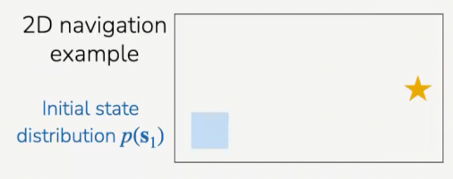

And let's say we can move in 2D. The reward is one at the tar, and 0 elsewhere,
it's very simple.

And let's say our current policy always goes to the right.

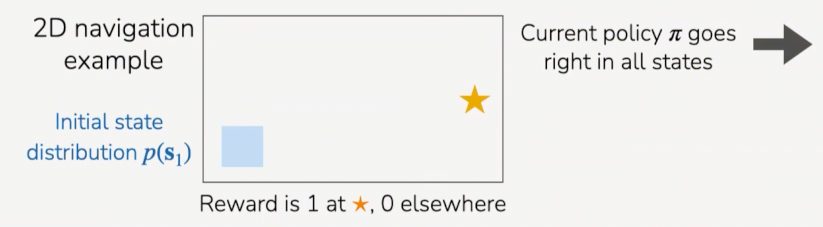

As one additional point of detail, if you're going to move up, it takes one
timestep to move about this distance and it takes about two time steps to mvoe
this distance.

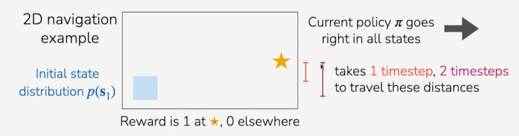

So my question for you is if you define this new policy, you have this current
policy that always goes right. You have an accurate estimate of the Q-values for
that policy. If you define this new policy, is that better than the current
policy? Is it worse than the current policy? Is it the same as the current
policy? Is it the optimal policy? And why or why not?

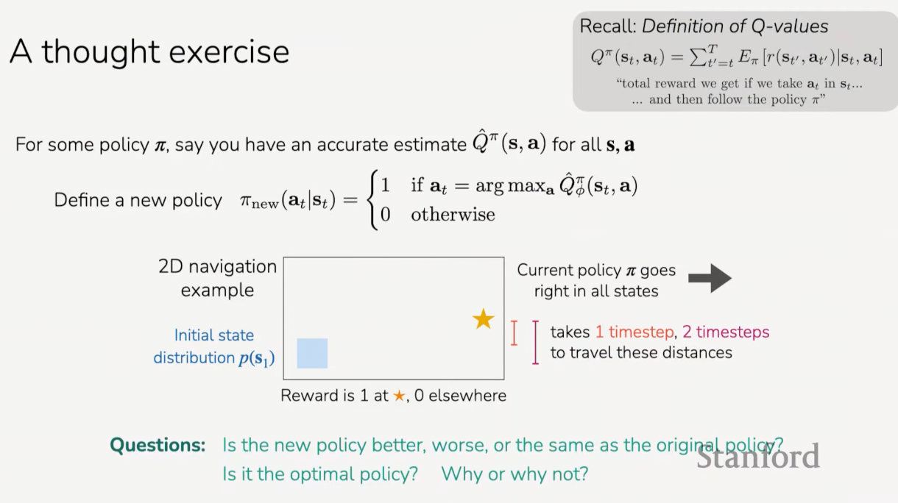

So let's establish what is happening, consider this representation on the board:

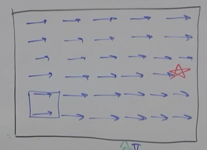

The old policy is going right, and so that is not optimal because if you're
starting here, then you're not going to hit the star. If you think about what
$Q^\pi$ is for the old policy, kind of everything in this region right here:

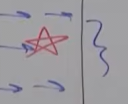

Is going to have a $Q^\pi(s, \rightarrow) = 1$ for all of these states and
actions, where $\rightarrow$ indicates the action $a$ is "moving right". So, for
example, if the action moves upwards, it might actually miss the star if it
follows the policy "move right" after taking that action.

And then if you think of what $Q^\pi$ starts to look like right here (one cell
below), the $Q^\pi(s, \rightarrow) = 0$ because we won't arrive at the star.
Now, what is the $Q$-value if from this position, we take the action of going
up? It is $Q^\pi(s, \uparrow) = 1$. This is because if we go up by one cell,
then follow the policy "go right", we will arrive at the star.

Lastly, if we go further down one row further down, if we have
$Q^\pi(s, \uparrow)$, we will get $Q^\pi(s, \uparrow) = 0$, because if go up and
then follow the policy, we will not arrive at the star.

So what this is going to do is it's going to be going right on the middle row
(directly to the star), and for the row directly below it, it will be going up,
because it's going to be choosing the action that has the maximum value of
$Q^\pi$. Then for the row below that one, the $Q-values$ are $0$ because all of
the $Q$-values for the next row, the following of the policy actions (go right)
are also $0$ (you can't reach the star by going up one and then following the
policy of going right.).

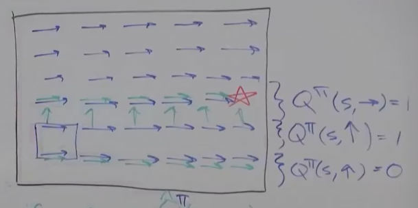

So, let's now ask the question: Is this the optimal policy?

So, the new policy is better than the old one (go up one and then go right
instead of just go right), but it's not the optimal one (it doesn't get the star
in all/most cases). So, if we iterate it a couple times though, it will (through
iteration, it will learn the basic topography of this matrix and adjust the
policy based off it's position in the matrix).

So the takeaway here is that this new policy will always be at least as good as
the old policy, assuming that $Q^\pi$ is accurate:

$$
{\pi'}_{\text{new}}(a_t|s_t) =
\begin{cases}
1 & \text{if } a_t = \arg\max_a\hat{Q}_{\phi}^{\pi}(s_t, a) \\
0 & \text{otherwise}
\end{cases}
$$

**Can we omit poilcy gradient completely?**

$Q^\pi(s_t, a_t)$: expected reward from taking $a_t$ and subsequently following
$\pi$

This is where we can start to think about: can we actually start omitting
policies?

$\arg \max_{a_t}Q^\pi(s_t, a_t)$: best action from $s_t$, if we then follow
$\pi$ afterwards.

So, $Q$ is the expected reward when we do this $\arg max$, we'll be taking the
best action from state $s$ if you then follow the policy $\pi$ afterwards.

And this is going to be at _least_ as good as any other action that the policy
would have taken, $a_t \sim \pi(a_t, s_t)$, _regardless_ of what the policy,
$\pi(a_t,s_t)$, is.

You can see that because it's taking the action that has the maximum expressive
reward.

This essentially indicates that we should forget policies, let's just do this!
This is done rather than actually explicitly learning a NN for the policy.

$$
{\pi'}_{\text{new}}(a_t|s_t) =
\begin{cases}
1 & \text{if } a_t = \arg\max_a\hat{Q}_{\phi}^{\pi}(s_t, a) \\
0 & \text{otherwise}
\end{cases}
$$

And so what this looks like as an iterative algorithm is we would run our policy
to collect data, then we would fit a model to estimate $Q^\pi$ according to that
latest batch of data. You could also do this in an off-policy way, like we
talked about in the last lecture. And then to improve your policy, you can just
define the policy to be the policy that maximizes your $Q$-value. And then, once
you define that new policy, you can collect some new data and then estimate
again $Q^\pi$, but in this case now $Q^\pi$ is your new policy and not your old
policy, and so on.

1. Run policy to collect batch data

2. Fit model to estimate expted return (Estimate $Q^\pi$)

3. Improve policy ($\pi \leftarrow \pi'$)

4. Repeat

Note again that the new policy is equal to the piecewise expression from
earlier. So we're not learning a NN for the policy $\pi$. We're not explicitly
representing it as a model, but it's helpful to have some notation to refer to
the system. The only model is the $Q$-function.

$$
{\pi'}_{\text{new}}(a_t|s_t) =
\begin{cases}
1 & \text{if } a_t = \arg\max_a\hat{Q}_{\phi}^{\pi}(s_t, a) \\
0 & \text{otherwise}
\end{cases}
$$

---

Q&A: 1

This is going to be easiest when you have a discrete set of actions that you
might take, like going up, going to the right, etc. If you have continuous
actions you actually can still use this algorithm. Although you need to figure
out how to perform that max operation. There's a couple ways you could
conceivably run the $\arg \max$ operation. In principle, you could use something
like gradient descent, although that turns out not to work very well. There's a
variety of reasons why that won't work very well. If your actions are not very
multidimensional, it might be better to simply try to sample a bunch of
different actions and pick the one that has the highest $Q$-value. There's other
sampling based optimization algorithms where you can iteratively sample and
refine your estimates from there.

If you have a discrete action space that's like text for example you could, in
principle, do some sort of discrete search over your things where the $Q$-value
is what your trying to maximize.

---

Q&A: 2

How does this work in cases where the rewards are very sparse?

We saw one example where the rewards are sparse, and it can still work in this
scenario. The thing that you need to be aware of when the rewards are sparse is
that you may need to do this loop of resetting the policy potentially a large
number of times because each time you do this. Like, the first time you do this,
you're actually only getting a good policy here (from the starting point of the
matrix), and if the matrix was much bigger, that would mean you need to keep on
doing it as you go down, and that is often referred to as a backup. You're sort
of backing up the reward from here (at the star) to the other state. And you'll
need to do those backups for as long as the horizon of the problem is. You need
to make sure you're doing many iterations.

**From actor-critic to critic only**

Off-policy actor critic with replay buffer

1. take action $a \sim \pi(a|s)$, get $s, a, s', r$, store in $\mathscr{R}$

2. sample a batch $\{s_i, a_i, r_i, s_{i}'\}$ from buffer $\mathscr{R}$

3. update $\hat{Q}_{\phi}^{\pi}$ using targets
   $y_i = r_i + \gamma\hat{Q}_{\phi}^{\pi}(s_{i}', a_{i}')$ where
   $a_{i}' \sim \pi(\cdot|s_{i}')$

4. $\nabla_\theta J(\theta) \approx \dfrac{1}{N}\sum_{i}{\nabla_\theta\log\pi_\theta(a_{i}^{\pi}, s_i)\hat{Q}^\pi(s_i, a_{i}^\pi)}$
   where $a_{i}^\pi \sim \pi_\theta(a|s_i)$

5. $\theta \leftarrow \theta + \alpha\nabla_\theta J(\theta)$

6. Repeat

So from this off-policy actor critic with replay buffer, we actually can remove
a few steps and add just one step to get closer to our algorithm for Q-learning.

Q-learning

1. take action $a \sim \pi(a|s)$, get $s, a, s', r$, store in $\mathscr{R}$

2. sample a batch $\{s_i, a_i, r_i, s_{i}'\}$ from buffer $\mathscr{R}$

3. update $\hat{Q}_{\phi}^{\pi}$ using targets
   $y_i = r_i + \gamma\hat{Q}_{\phi}^{\pi}(s_{i}', a_{i}')$ where
   $a_{i}' \sim \pi(\cdot|s_{i}')$ (policy evaluation) (Note: can do multiple
   gradient steps here)

4. define new Policy (policy improvement)

$$
\pi(a_t|s_t) =
\begin{cases}
1 & \text{if } a_t = \arg\max_a\hat{Q}_{\phi}^{\pi}(s_t, a) \\
0 & \text{otherwise}
\end{cases}
$$

5. Repeat

This is often called "Policy iteration".

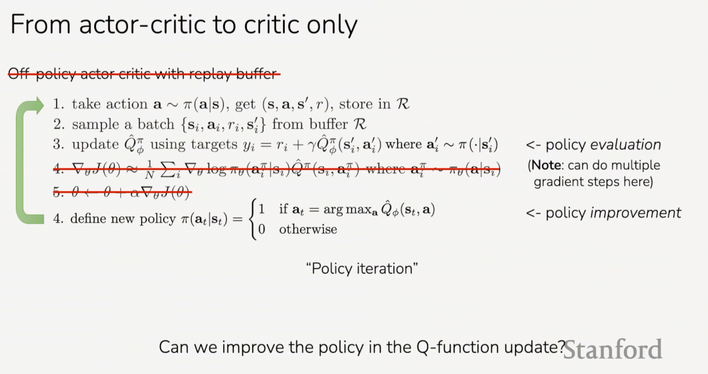

To write this out on the board we have:

0. Collect data from $\pi$

1. Fit $\hat{Q}^\pi(s, a)$ using the target from the last section
   $y_i = r(s,a) + \gamma Q(s', a')$ Where $r(s,a)$ is sampled from the buffer,
   and $a'$ is sampled form the policy $a' \sim \pi(\cdot|s')$

2. Improve our policy:

$$
\pi(a_t|s_t) =
\begin{cases}
1 & \text{if } a_t = \arg\max_a\hat{Q}_{\phi}^{\pi}(s_t, a) \\
0 & \text{otherwise}
\end{cases}
$$

---

Q/A:

Is this policy deterministic?

Yes, this policy is deterministic. This is actually one reason why you might not
want to collect data from this policy because you're not going to have many data
states in your actions. And we'll talk in a couple slides about what policy you
might want to collect data from instead.

---

Why are we sampling from $a'$ and not an average over actions?

There's a couple things here. First, you can do an average and sample multiple
times and that actually will give you a better estimate of the target value. The
second thing is instead of sampling this from $\pi$,
$a_{i}' \sim \pi(\cdot|s_{i}')$, you can actually do this improvement step in
the $Q$-function target itself. You can actually define it this way:

$$ \underbrace{y_i = r_i + \gamma\max_{a'}\hat{Q}_{\phi}(s_{i}',a')}_{\text{Q-values for your new policy!}} $$

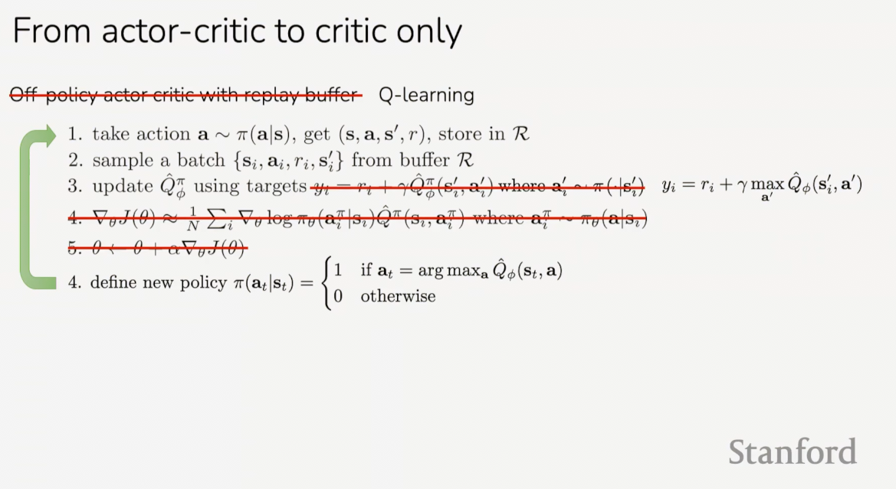

You can think of this as already putting the improvement step in your
$Q$-function update, and you're actually learning the $Q$-values associated with
the new policy that you're going to be defining.

---

Q-learning

1. take action $a \sim \pi(a|s)$, get $s, a, s', r$, store in $\mathscr{R}$

2. sample a batch $\{s_i, a_i, r_i, s_{i}'\}$ from buffer $\mathscr{R}$

3. update $\hat{Q}_{\phi}^{\pi}$ using targets
   $y_i = r_i + \gamma\max_{a'}\hat{Q}_{\phi}(s_{i}',a')$

4. define new Policy (policy improvement)

$$
\pi(a_t|s_t) =
\begin{cases}
1 & \text{if } a_t = \arg\max_a\hat{Q}_{\phi}^{\pi}(s_t, a) \\
0 & \text{otherwise}
\end{cases}
$$

5. Repeat

**Why does this make sense?**

Recall:

$$ Q^\pi(s,a) = r(s,a) + \gamma\mathbb{E}_{s' \sim p(\cdot|s,a),\overline{a}' \sim \pi(\cdot|s')}\left[Q^\pi(s',\overline{a})\right] \forall (s,a) $$

This equation is true for all states and actions. So we defined that the
$Q$-function is equal to the reward plus the function at the next state. This is
true for all states and actions. It's actually also true for any policy.

This holds for any policy $\pi$

Including the optimal policy. You can actually write down another equation that
is specifically for the optimal policy. In particular, we know that the optimal
policy is always going to be taking the actions that maximize our future
rewards.

The optimal plicy is always going to be the action that maximizes the $Q$-value.
And so we can write down an equation that holds just for the optimal policy,
which is the same equation as the one there, except instead of an expectation
over the next action, it's a maximization over the next action. So what that
looks like is:

$$ Q^{\pi^*}(s,a) = r(s,a) + \gamma\mathbb{E}_{s' \sim p(\cdot|s,a)}\left[\max_{a'}Q(s',a')\right] $$

We're defining the $Q$-function as the reward at the current time step plus the
sum of the future rewards. And for that sum of future rewards we have some
expectation over the next state that will happen. And because we know that the
optimal policy, or the best policy, is going to be taking the action that is
maximizing the $Q$-value, then we can write this as the max of $Q$ at the next
state.

---

Q/A?

Why are we talking all about $Q$ and why not $V$?

So you actually can write down all of these equations for $V$ in a very similar
way. The thing that's very nice about $Q$ is that we can actually get a policy
out of $Q$. So if we know what $Q$ is, then we can do this $\arg \max_{a}$ over
actions to get a policy that's better than our previous policy. Whereas with the
value function, if we only know $V(s)$, then we don't know which action will
lead to higher rewards. In principle, with the value function, you could try to
do some sort of look ahead. If you have a sense of what the dynamics are, you
could then try to predict what $s'$ is, and then try to pick actions that are
maximizing that. What that would look like is:

$$ \max_{a}\mathbb{E}_{s'\sim p(\cdot|s,a)}V(s') $$

You could, in principle, try to do something like this, but we don't know what
these dynamics, $s'\sim p(\cdot|s,a)$, are. And we can't necessary predict what
the next state will be as a consequence of our actions. So in general it's a lot
harder to get a policy out of a value function, and to improve our policy
ultimately, with a value function than it is with a $Q$-function.

---

So now going back to this equation, this is true for the optimal policy and this
is for $Q^{\pi^*}$, where I'm writing $\pi^*$ as the optimal policy.

$$ Q^{\pi^*}(s,a) = r(s,a) + \gamma\mathbb{E}_{s' \sim p(\cdot|s,a)}\left[\max_{\overline{a}'}Q^{\pi^*}(s', \overline{a}')\right] $$

And if we look at our update step equation here:

$$ y_i = r_i + \gamma\max_{a'}\hat{Q}_{\phi}(s_{i}',a') $$

We're trying to fit a $Q$-function that is predicting this. Essentially with the
optimal $Q^{\pi^*}$ equation, you can think about it as this update, as we are
trying to make this equation true.

$$ Q^{\pi^*}(s,a) = r(s,a) + \gamma\mathbb{E}_{s' \sim p(\cdot|s,a)}\left[\max_{\overline{a}'}Q^{\pi^*}(s', \overline{a}')\right] \forall (s,a) $$

So we're trying to make the left side of the equation tot he right side of the
equation. And when this equation is true, it means that our policy is the
optimal one.

So essentially one way to think about $Q$-learning is that when we're optimizing
step 3, we're trying to find a $Q$-function such that it satisfies this
equation, which is only true for the optimal policy.

---

Q/A:

Is this an "if and only if" condition?

This is an "if and only if" condition. This only holds true for the optimal
policy and if you have the optimal policy, then this must be true.

---

If we have really good estimates of $Q$, will this converge? We'll talk about
this in one minute, bu t first let's talk about some terminology real quick.

RL has a ton of terminology, it's useful to know some of it so that if someone's
talking to you about RL or you're reading a paper, you know what they're talking
about. This first equation is often referred to as the
[Bellman Equation](https://en.wikipedia.org/wiki/Bellman_equation). It's a very
useful object. It is what we were using to try to do policy evaluations for a
policy:

$$ Q^\pi(s,a) = r(s,a) + \gamma\mathbb{E}_{s' \sim p(\cdot|s,a),\overline{a}' \sim \pi(\cdot|s')}\left[Q^\pi(s',\overline{a})\right] \forall (s,a) $$

And the second equation, it's called the
[Bellman Optimality Equation](https://www.sciencedirect.com/topics/engineering/bellman-optimality-equation),
because it's specifically for optimal policy:

$$ Q^{\pi^*}(s,a) = r(s,a) + \gamma\mathbb{E}_{s' \sim p(\cdot|s,a)}\left[\max_{\overline{a}'}Q^{\pi^*}(s', \overline{a}')\right] \forall (s,a) $$

Sometimes, people might informally call the second one a Bellman equation as
well. But, yeah, officially, the first one is the bellman equation, and the
second one is Belman Optimality. You can derive ones that are equations that are
also for the value function $V$ instead of the $Q$ function, and people often
also refer to those as Bellman equations and Bellman Optimality equations.

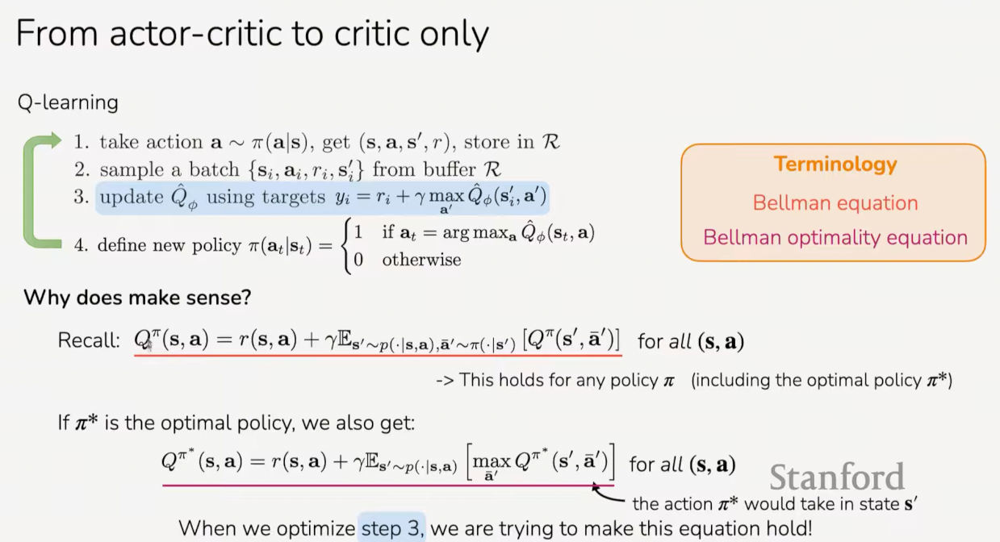

---

Alright, so getting back to the question: If we do this iteratively, will we
converge to the optimal policy?

So, there's good news and bad news here.

The good news is that if you're in a very simple setting where you can actually
store all of your key values in a table for every single state and action. So
this would be for a very small discrete state and action space. And if you have
sufficient exploration, then this algorithm will converge. So that's the good
news.

The bad news is that basically in any other scenario, it is not guaranteed to
converge. You can construct scenarios when it diverges even with just linear
functions, which is kind of sad. The flip side of that is that even though it
can diverge in scenarios, it can still be made to work very well, and we'll see
some examples of it working very well at the end of the lecture.

**Will this algorithm converge to optimal $Q^{\pi^*}$?**

Yes, if you maintain a table of $Q$-values for every state and action. More
generally, no.

Can construct scenarios where it diverges, evne with linear $Q$. _But_, it can
be made to work well.

**Note:** Q-learning is **off-policy**

In particular this optimization equation holds for all state and actions, and
that means that we don't have to have the actions coming from our current
policy. In particular, it might make a lot of sense for it to be broader than
our current policy. Because we're going to be doing this maximization over our
$Q$-values. So when we do this maximization, we're going to be considering a lot
of different possible actions. If we have a discrete action space, we might
actually just consider all of the possible actions, and when we do that, we
would want all of our $Q$-values to be accurate when we're considering all of
them. And if there's one action that we haven't collected data for that we're
going to be considering in this optimizaation, it might be erroneously high
because we didn't collect any data for it, and then you'll get an inaccurate
target value when you are fitting.

So, instead of taking collecting data from our current policy, it'd be useful to
collect data from some exploration policy that's specifically a policy that's
collecting a broader set of actions than our deterministic policy.

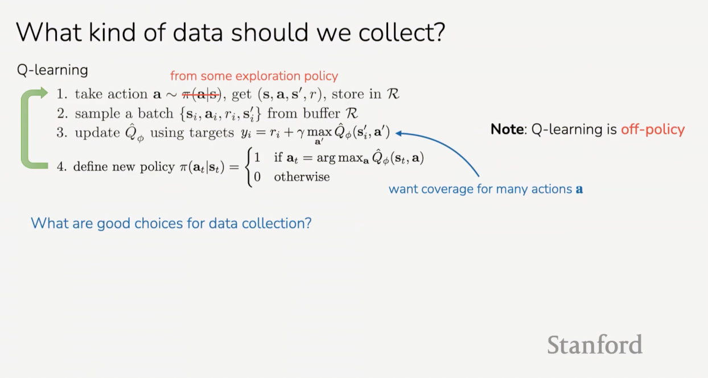

So we want covered for a lot of different actions specifically for this term at
step 3, $a$. And there's a couple of choices here. One choice is to mostly
follow our policy most of the time, but with some small probability take a
completely random action. And so, what that would look like is:

$$
\pi_{\text{exploration}} =
\begin{cases}
\text{random action} & \text{w/ prob } \epsilon \\
\pi(\cdot|s)& \text{w/ prob } 1 - \epsilon
\end{cases}
$$

A policy that with some probability, and say take a random action with
probability $\epsilon$, and follow, maybe we call this
$\pi_{\text{exploration}}$, and follow your current policy with probabiliyt
$1 - \epsilon$.

And you can write this out slightly more formally as:

$$
\pi(a_t|s_t) =
\begin{cases}
1 - \epsilon & \text{if } a_t = \arg \max_{a_t}Q_{\phi}(s_t,a_t) \\
\epsilon/ \left(|\mathscr{A}| - 1\right) & \text{otherwise}
\end{cases}
$$

This can be a good choice, because it means that when you take a action
uniformly at random, it means that you'll get very good coverage of the actions
that you consider. And oftentimes, as you proceed through training, you might
start with a larger $\epsilon$, so that you have more exploration at the
beginning of training, and then as your policy is getting better and as you're
getting a better estimate of your $Q$-function, you can then make this smaller
and explore less as you go through things.

This is called "epsilon-greedy" because you are being greedy some of the time
and epsilon probability of the time, you're not being greedy and just taking a
risk.

Okay, and then another choice that is also somewhat reasonable, although a
little bit more complicated is to take actions with probability that is
proportional to the $Q$-values. And so if you have actions that have a higher
$Q$-value, then take those actions more frequently, and if you have actions with
lower probability, then take those actions less frequently.

So one way to write this is:

$$ \pi(a_t|s_t) \propto \exp(Q_{\phi}(s_t, a_t)) $$

So you could exponentiate your $Q$ values so that they're all positive, and then
normalize in orer to get a probability distribution over actions.

This is known as
[Boltzmann exploration](https://en.wikipedia.org/wiki/Boltzmann_machine).

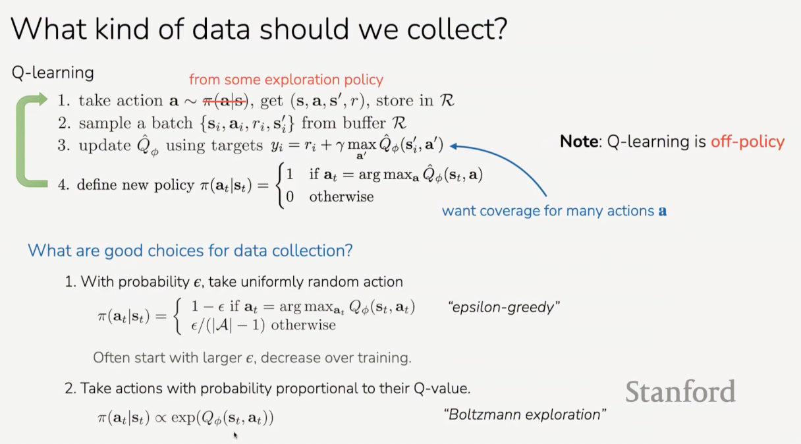

## Putting it together

full Q-learning with replay buffer:

1. collect data $\{(s_i, a_i, s_{i}', r_i)\}$ using some policy, add it to
   $\mathscr{R}$

   a. sample a batch $(s_i, a_i, s_{i}', r_i)$ from $\mathscr{R}$

   b.
   $\phi \leftarrow \phi - \alpha\sum_{i}{\dfrac{dQ_\phi}{d\phi}(s_i, a_i)\left(Q_\phi(s_i, a_i) - \left[r(s_i, a_i) + \gamma\max_{a'}Q_\phi(s_{i}', a')\right]\right)}$

   c. Repeat a and b multiple times, $K$ times.

2. After taking $K$ gradient steps, repeat 1.a.

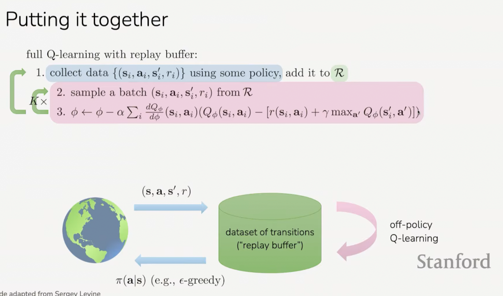

**How to make Q-learning stable?**

1. collect data $\{(s_i, a_i, s_{i}', r_i)\}$ using some policy, add it to
   $\mathscr{R}$

   a. sample a batch $(s_i, a_i, s_{i}', r_i)$ from $\mathscr{R}$

   b.
   $\phi \leftarrow \phi - \alpha\sum_{i}{\dfrac{dQ_\phi}{d\phi}(s_i, a_i)\left(Q_\phi(s_i, a_i) - \left[r(s_i, a_i) + \gamma\max_{a'}Q_\phi(s_{i}', a')\right]\right)}$

   c. Repeat a and b multiple times, $K$ times.

2. After taking $K$ gradient steps, repeat 1.a.
